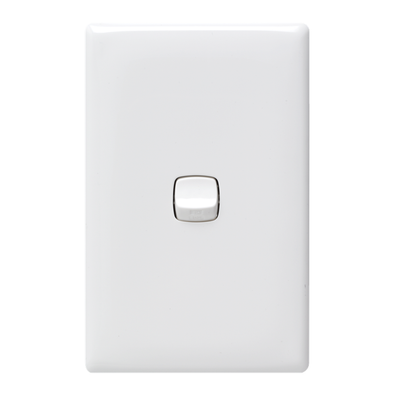

# Panic Button (Made From a Smoke Detector)

Source: https://www.instructables.com/Panic-Button-Made-From-a-Smoke-Detector/

---

## Introduction

“This Alarm will sound every 3 seconds, unless something isn’t ok” - Homer Simpson.

I got inspired recently after seeing the Simpsons ep where Homer becomes an inventor to follow in Edison’s footsteps. One of the inventions is a smoke alarm which goes off every 3 seconds to confirm all is good. Well instead of having it go off all the time, I thought it would make a good panic button. Everyone one knows how loud and annoying smoke alarms are, so having a panic button made from one would definitely scare off any would be thieves etc.

I had an old smoke alarm sitting around so I decided to pull it apart and see what I could do with it. I also had a wall light switch which I thought would make a great cover for the panic button.

This is a pretty simple ible’ but as a personal panic button, it works a treat. Ideally, the best thing to do would be to have the light switch embedded into a wall so it looks inconspicuous. I decided to make it portable for my first attempt.

## Step 1: Things to Gather

Parts:

1. Smoke Alarm. - eBay. If you buy one to use in this project, then make sure you just replace an old one and use this. Not worth destroying a new one if you don’t have to

2. Light switch – [eBay](http://www.ebay.com.au/sch/i.html?_from=R40&_trksid=p2050601.m570.l1313.TR1.TRC0.A0.H0.X1+Gang+Light+Switch.TRS0&_nkw=1+Gang+Light+Switch&_sacat=0) [Bunnings](https://www.bunnings.com.au/hpm-white-linea-1-gang-light-switch_p4330578) / hardware store

3. Mounting Block for the light switch – [eBay](http://www.ebay.com.au/sch/i.html?_odkw=37mm+Surface+Mounting+Block&_osacat=0&_from=R40&_trksid=p2045573.m570.l1313.TR0.TRC0.H0.X34mm+Surface+Mounting+Block.TRS0&_nkw=34mm+Surface+Mounting+Block&_sacat=0), [Bunnings](https://www.bunnings.com.au/hpm-37mm-deep-white-surface-mounting-block_p7053474) / hardware store

4. White flute board (for the back if you are not wall mounting it)

Tools

1. Soldering Iron

2. Pliers

3. Screwdrivers and the usual basic tools

4. Testing pins - I will show you how to make these. It allows you to touch a couple of solder points to connect them.

5. Superglue

6. Hot Glue

7. Dremel

## Step 2: Pull Apart Your Smoke Detector

First things first, you will need to pull apart you smoke detector and pull the innards out. More than likely your smoke detector will be a different model to mine. I believe however that they are all pretty similar and use the same basic parts. I will go through how I hacked mine but you will probably have to play around a little on your one to find the best way to hack it.

Steps:

1. Un-screw the case. Mine had one screw holding it together

2. Remove the circuit board and battery holder from the case

3. Attach a battery to it and make sure it still works. All smoke detectors have a test button which will make your alarm go off. Give a push and see if it is still working.

## Step 3: Removing the Radioactive Bit

You may have noticed that there is a radioactive symbol on the smoke detector. That’s because most use a small amount of americium-241, a radioactive material in the “ionization chamber”. Smoke particles disrupt the low, steady electrical current produced by radioactive particles and trigger the detector's alarm. You won’t need the ionization chamber so we will be pulling this off. Please make sure that you dispose of the ionization chamber correctly. Anywhere that sells smoke detectors has to take them back.

Steps:

1. Take a look at the ionization chamber and see how it is joined to the circuit board. You will probably see a couple wires joined to it along with a chunk of solder in the middle

2. First cut any wires that are attached to it

3. Next, that chunk of solder is actually a screw (it is in mine anyhow) so get a good hold of the ionization chamber and give it a twist. It should un-screw from the circuit board. If not, you may have to cut it away.

4. Once removed, put it to one side and dispose of correctly.

## Step 4: Modding the Circuit Board

So now that you have removed the Ionization chamber, it’s time to work out how to turn on and off the fire alarm.

Steps:

1. As mentioned previously, all of these alarms have a test switch. Usually these are quite basic. Mine worked by making a connection with the ionization chamber. As I had removed this I had to come up with another way. The best way to figure out which solder mounts will turn your smoke detector on and off is to do some testing. Start with the test on/off switch. Touch a wire to this and any part that the ionization chamber was connected to. Does it turn on and off when you remove the wire? If so, you can just use this as your switch. Unfortunately mine didn’t so I had to do some experimentation.

2. With a piece of wire, I connected different parts of the circuit board to see what would turn on and off the fire alarm. Below is how I did mine but as I mentioned previously, you probably have a different one to me so experiment until you come up with a way. It took me about 5 minutes to work out one and it isn’t hard.

3. So what I did was attach a wire from the solder mount of the test switch to one of the legs on the IC. there was a hole in the circuit board where one of the legs from the IC was sticking out. that was the one I soldered the wire to.

4. Next I attached a wire to a solder point that the buzzer was solder to and another wire to a negative solder point. when I touched these 2 together the buzzer would come on. Now I had a way to turn it on and off

5. Actually, while experimenting I worked out a way to change the pitch of the alarm. I decided to leave as is but if you wanted to you could change the pitch quite easily.

## Step 5: Modding the Surface Mount

If you aren’t going to put your panic alarm switch into a wall, then you need to make it portable. I decided to use a wall mounting block. I knew that the light switch would fit ok and there is just enough room for the circuit board and beeper. You will however have to mod it as the light switch wasn’t meant to sit flush with the mounting block. Plus you need to make some extra room for the circuit board and beeper.

Steps:

1. First thing is to decide how to mount the circuit board and beeper inside the mounting block. As I wasn’t mounting to a wall, I decided to mount the switch on the wrong side of the block. Reason being, I found that it was easier to attach the switch and also mod the mount. I would have to come up with a way to secure the switch to the mount but I worried about this later.

2. Work out which sections to cut away and with a dremel make the cuts

3. Continuously add the circuit board and beeper into the mount until it fits how you need it to

## Step 6: Modding the Switch

To allow the battery to fit, I needed to remove some of the gussets off the switch. As these offer support for everyday use, it would harm the integrity of the project as hopefully you won’t be using it too often!

Steps:

1. Place the battery, circuit and beeper into the mount

2. Try and put the switch cover on the top. If it doesn’t sit flush, work out and mark the parts which are touching the gusset section on the light switch

3. Remove the parts with a dremel or wire cutters. Keep on removing parts until the cover sits flat on the mount

## Step 7: Adding the Circuit Board to the Mount

I decided to remove the buzzer from the circuit board so I could fit the whole thing better into the mount. You don’t have to do this but I did find it was a lot easier to get everything inside the mount.

Steps:

1. The buzzer was attached by 3 prongs which came away from the circuit board with a twist. There was also 1 wire attached which I de-soldered as well. The wire that I removed was where I joined one of the wires for the on/off switch so I had to make sure that I added a wire from the buzzer back to the circuit board which I did.

2. Mod the mount where necessary and decide the best place to add the buzzer.

3. Add the battery as well and make sure everything closes.

## Step 8: Working Out a Way to Attach the Light Switch to the Mount

Modding the surface mount meant I could only use one of the original nuts in the mount. I had to come-up with a way to attach the switch so it would be secure and removable so I could change the battery

Steps:

1. You can see that the mount also included 4 holes to mount to the wall. I decided to use one of these as a mounting point.

2. First I added a small nut to the hole. I had to drill out slightly and squash the nut into the hole. You could probably heat-up the nut and push it into the mount to get a good fix.

3. Next add some superglue to keep in place

4. Place the light switch on the mount and turn it upside down so the switch is on the bottom. With a drill make a hole into the light switch through the nut hole

5. The hole in the light switch needs to be big enough to fit the top of the screw into but not so big that the screw gores all the way through – in other words, just right.

6. Screw the screw into place. You will need to make the head of the screw flush with the light switch so the cover goes on.

7. Un-screw once tested.

## Step 9: Add a Backing to the Mount

Steps:

1. You could use wood for this but I just went with some flute board. Measure and cut a piece to fit onto the back of the mount.

2. Superglue into pace

## Step 10: Adding the Circuit Board to the Mount

Steps:

1. Add some hot glue to the bottom of the flute board and glue the circuit board into place

2. Next, add the buzzer and hot glue that into place as well.

3. Now it’s time to wire the switch up. Add the wires you added to the circuit board to the switch terminals and test. If everything works ok (shouldn’t be any reason why it shouldn’t work as you would have tested it when decided where to solder the wires)

4. Screw the switch into place

Done!

---
*38 images archived*
