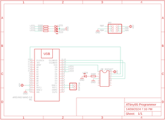

# Programmer for ATtiny 85

Source: https://www.instructables.com/Programmer-for-ATtiny-85/

---

## Introduction

## Supplies

Along with the hardware below, you will also need to get one of the custom PCB's printed. I've explained how to do this in the next step.PARTS:Arduino Nano - Ali ExpressHeader Pins Female - (Length - 15 pins) X 2 - Ali ExpressHeader Pins female - (2X3) - Ali ExpressZif 14 ic socket - Ali Express330R Resistors X 4 - Ali ExpressLED - 3mm (any colours) X 4 - Ali Express10uf Capacitor - Ali Express

## Step 1: Getting the PCB Printed

Firstly, you can find all of the files including the gerber files for this build in my GitHub PageTo get your board printed, You’ll need to send the Gerber files to a PCB manufacturer like JLCPCB (Not affiliated) who will print the boards for you. Jump into my Google Drive link, download the Gerber file to your computer and then send them off to your PCB manufacturer of choice.If you have no idea how to do this well, I've put together an Instructable on how to get your broads printed which you can find here.If you are interested in having a look at the schematic or board files then I have included these as well and you can also find them in my Google Drive. I've also attached the schematic to this step.

## Step 2: Adding Components to the PCB Part 1

This is pretty straight forward as there really aren't many components to add to the PCB!   STEPS:Always stsrt with the lowest profile components which in this case is the resistorsSolder the 4 LED's into place.  3 of these are indicators when the sketch is uploading, the other is for the blink skech whih we will load upa little laer to the ATtiny. It's a simple way to make sure everything is working as it should be.Next you can add the header pins in for the capacitot.  The capcitor is removable as you can sometimes have issues with loading Sketches when it is in place.I've also included a header pin so you can use jumper wires to connect to an ATtiny if it is soldered in place to a PCB.  This can also be soldered into place.Now you can add the Arduino to he PCB.   Make sure that you add the header pins in first to the Arduino and then solder it intp place to the PCB. It will ensure that the Arduino is lined up right and the header pins go in straight

## Step 3: Adding Components to the PCB Part 2

Now it's time to add he ZIF socket IC holder. This is an easy way o hold he ATtiny into place whist you are programming itSTEPS:Place the socket holder ino place in he PCBMake sure that the little lock handle is facing down towards the LED'sNow you can solder it into placeTrim the capacitor legs and place into the 2 header pin.  I have indicaed on the board wih a little - symbol which leg of the cap needs to go to ground.Lastly, add a ATtiny to the ZIP socket holderThat's it - you are now ready to sart programming your ATtiny

## Step 4: Programming the ATtiny 85

I've actually done an 'Ible now how to program the ATtiny using a Aduino Nano which you can find hereHowever, I've also gone through he process again in the vid that you can find in the introSTEPS:Once you are ready to upload the blink sketch to the ATtiny (just follow the steps in the vid or the link above), open the 'blink sketch' in my Google DriveUpload the sketch to your ATtiny 85Watch the little LED blink away!Once you have mastered this basic upload to the ATtiny, you can then move on to more fun things like these games that I made, or whatever projects that you can find on line.  You might even want to try your hand at coding!  baby steps first.I hope this Instrucable was of some help - if you have any questions, please don't hesitate to add a comment and let me know!All the bestLonesoulsurfer

---
*23 images archived*
