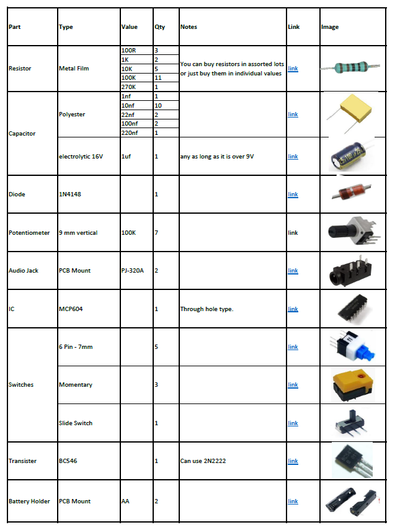
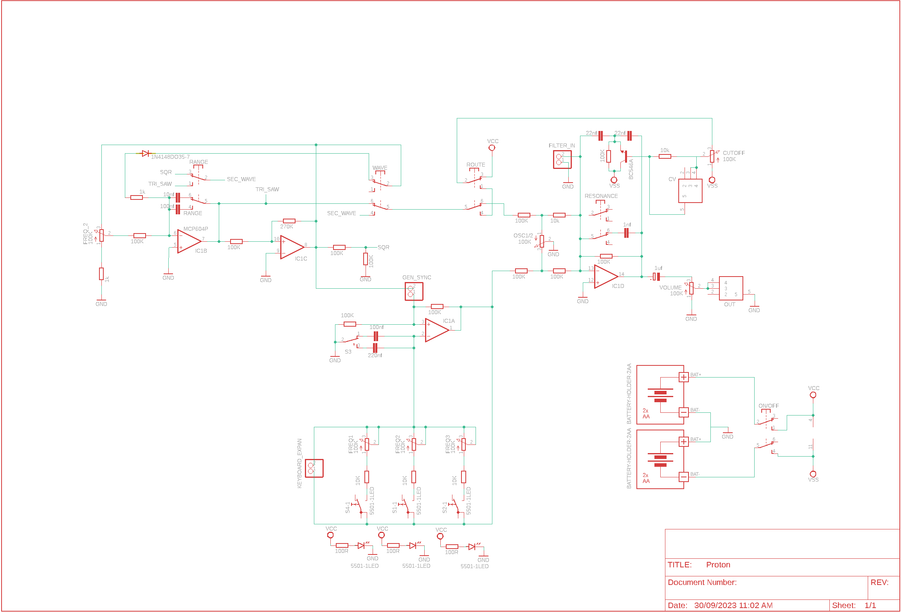
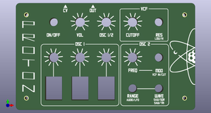
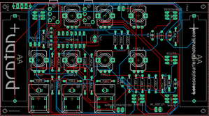
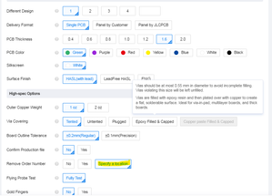

# Proton - Little Synths With BIG Sounds #2

Source: https://www.instructables.com/Proton-Little-Synths-With-BIG-Sounds-2/

---

## Introduction

This is the 2nd in a series of little synths that I'll be publishing over the next few builds. Like my Elements synth, I've kept everything as simple as possible on this build so anyone with a soldering iron and basic soldering skills can make it. I've done away with a case and fancy power supplies to keep the build simple.

Props to Synther Jack who designed this amazing little synth. All I've done is redesigned the PCB and created a front panel. I've also done a couple of mods and have included these on this build. Please check out Synther Jacks write up if you want a thorough run through on how the synth works.

The synth runs off 1 IC which is an incredible feat when you consider the amazing sounds this beast can produce. The other amazing thing about this synth is it only needs 2 X AA batteries to power it!

It's a blast to play with and can be connected to a sequencer which really shows off the sounds this little synth is capable of producing. If you don't have a sequencer then don't worry - it's still tonnes of fun to play.

I've provided all of the gerber files, schematics etc in this build so all you need to do is to get them printed (I'll go through how to do this as well) and add the components.

Check out the vid to hear it in action

## Supplies

Instead of adding a long list of parts to this step - I decided to instead include the parts list as a PDF file which is attached. The file includes all of the components and auxiliary parts that you will need to put the circuit board together. I have included links and images of each part so you can easily find/buy/identify them. I think it will be handy also as a PDF as you can print it off, visit your local electronics store and tick them off as you get them.

The parts list is also available on my GitHub Page in Excel format

The below parts are the rest that you will need to build the synth.

PARTS (Other than circuit components):

- 2 X AA Batteries
- Nylon Hex Stand offs Assorted 2mm - Ali Express. These will be used to connect the front panel to the PCB
- A4 Clear Acrylic (3mm) - eBay This is for the base. It isn't necessary but will protect the electronics and finishes of the build nicely.
- Potentiometer Knobs (9.5mm) X7 NOTE: These are quite small knobs which suit the PCB. Make sure you don't get the 'D' type as they won't fit onto the potentiometers- Ali Express
- Button Caps for the 6 pin switches X 5 - Ali Express
That's it! You don't have to worry bout building a case because it doesn't have one :)

The rest of the parts can be found in the PDF attached below or on my GitHub Page

## Step 1: Front Panel, Schematic & Eagle Files

Firstly, all of the files that you need can be found in my GitHub Page

To get your own PCB and front panel printed, you will need to send the Gerber files to a PCB manufacturer like JLCPCB (Not affiliated) who will print the boards for you. If you have no idea how to do this well I've put together an Instructable on how to get your broads printed which you can find here.

NOTE: the ,manufacture will include a order number on both the PCB and front panel. It doesn't really matter about including it on the PCB but you don't want to do what I did and have it included on the front panel! You can 'specify a location' once the Gerber files have been loaded so hit this and the manufacturer will add it to the back of the front panel. You can also just hit 'No' when asked if you want to remove the order number. However, this costs $2.

Front Panel

The front panel is actually just a PCB without the components! I use the slik screen on the PCB for printing the design and then include drill holes for the components. All this information is in the Gerber files for the front panel which the manufacturer uses to print the board.

If you are interested in creating your own front panels then I highly recommend watching this YouTube vid. I watched it as couple times and also put together a step by step guide for myself which I have also included as a PDF in this step.

In my GitHub Page you will also find the Eagle schematic and board (PCB) files. You can play around and modify these if you like.

Parts list for the circuit board can be found in the supplies step above and I've also provided the list in excel which can also be found (surprise) in my Google Drive.

## Step 2: Adding Components to the PCB - Reverse Sise

The board is 2 sidded, top side has all of the controls such as potentiometers, switches etc . The reverse side has all of the passive components like the resistors, capacitors, IC etc. We'll be starting with the reverse side first. You always want to start with the lowest profile components which in most cases this is the resistors.

STEPS:

- I'm sure you will have a multimeter and if you don't - grab yourself one. Test each resistor before soldering into place to double check the value. It takes a little extra time but it will save you a heap of time in the long run if you have to troubleshoot later on.
- Keep adding the resistors (i usually do them in little group of about 6) until they are all soldered into place
- Keep on making your way up with the next highest profile parts - in this case it's the IC socket. It's always good practice to use IC sockets so you can easily change the IC's out if one is faulty.

## Step 3: Adding Components to the PCB Reverse Side - Continued

STEPS

- Next add the caps, checking the values and orientation and solder them into place.
- You can now go ahead and add the IC's into the IC sockets.
- There is a small toggle switch that needs to be added near the top of the board. This is a bit of an Easter egg so I'll leave the explanation of this one and you can use it once you have built the synth.
- You can solder the AA battery holders into place now as well. I added a little superglue to the bottom of them to secure them into place. You could also just drill a hole into the PCB and fit a small screw and nut to hold them into place.
There actually isn't a lot of passive components on this synth!

## Step 4: Adding the Components to the Front Side of the PCB

Now it is time to flip the PCB over and add the components to the front of the board. These are the control components like the potentiometers and switches

STEPS:

- Same thing when adding components to the front - start with the lowest profile parts first - in this case it's the 6 pin switches. Careful when adding solder to the legs as the solder pads are very close together and you could easily bridge them! Not the end of the world but a little annoying when you have to remove too much solder.
- NOTE- The 6 pin switch should be added with the little notch on the back facing up. This will ensure that they are 'normally off'. If you don't then it isn't the end of the world but the switches will be reversed.
- There is a small slide switch that needs to be added near the top of the board. This is a bit of an Easter egg so I'll leave the explanation of this one and you can use it once you have built the synth.
- Now you can add all of the potentiometers into place, no need to check the values as they are all 100K!. I also left off soldering the tabs on the potentiometers until I've tested everything first. This way if something is wrong you can easily de-solder them if necessary.
- Next solder the momentary switch's into place
Best to test the board now and make sure everything works. Add a battery, turn the synth on and plug in a portable speaker. You should hear the synth make noise. If not, play around with the pots and switches a little. If you still don't hear anything then you might need to do some troubleshooting.

## Step 5: Adding the Front Panel & Pot Knobs

Adding the front panel to the PCB and watching it fit perfectly over the switches and pots is a great feeling. The design and look of the synth before then is just a concept so when everything fits just right makes it all worth while.

STEPS:

- To secure the board to the PCB, you'll need to use some spacers. Buy an assorted pack of them which I have linked in the supply section. Attach 8mm spacers with male screw ends to the 4 holes in the front panel.
- Secure each one into place with a 2mm screw. These come with the spacers but you can also buy some metal ones if you wanted to forgo using the plastic screws (which is what I did!)
- Push the ends of the spacers into the PCB and secure with a couple more spacers. They need to be long enough to ensure no components are touching the ground. I used a 8mm and a 10mm which did the trick.
- You can also add the potentiometer knobs as well if you like along with the buttons to the 6 pin switches
Now at this stage you could leave it as is and be done. The spacers acting like little legs holding the batteries and components away from the table. However, I decided to add some clear acrylic to the bottom to hep protect the electronics. It's really easy to do and gives the synth a nice finish so check out the next step on how to do it

## Step 6: Adding the Clear Acrylic Bottom

STEPS:

- Place one of the front panels (you would have received 5 of them when ordered) on top of the the acrylic and mark out the sides and also the screw holes
- Cut the acrylic to size (I used a band saw to do this) and then drill out the holes with a 2.5mm drill bit.
- Place the acrylic onto the spacers and secure into place
- Lastly, add some clear, sticky bottom rubber 'feet' to keep everything steady.

## Step 7: How to Play It

I don't want to give too many tips on how to play it as it's fun just working it out for yourself. I thought I should give a few hits and tricks so have a read of the below to get started.

STEPS:

- There are 2 Oscillators in this synth. You can control each one separately or simultaneously. To control Osc 1 make sure that all of the buttons are turned off in the Freg section. You can also either turn on or off cut off as will but I like to leave it on
- How turn Osc 1 pot all the to the left and you'll hear osc 1. Play around with the cut off filter
- If you turn Osc 2 you will hear that the 2 oscillators playing at the same time. Keep turning Osc 1 to the right and you will then hear osc 2.
- Play around with the wave and route buttons and also Osc 2 pot and see what sounds you can get
- You cam also tune the 3 keys so that they are playing chords. Download 'piano tuner' on your phone and use the pots to tune each of the keys to a note.
- don't forget about the small micro toggle switch that is connected to the PCB. If you hit that the pitch will either increase or decrease
- If you have a sequencer then plug it into CV on the PCB - Make sure you have cut off turned on as this will be the main way that you will get notes onto the sequencer
I think I'm going to leave it there. You can mess about with different combinations of waveforms and oscillators to create some amazing sounds with this little synth.

If you do decide to make this then good luck with the build and let me know if you have any questions.

---
*48 images archived*
