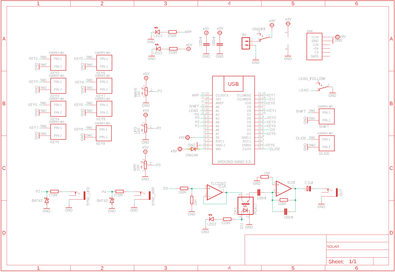

# Solar - Arduino Based Synth

Source: https://www.instructables.com/Solar-Arduino-Based-Synth/

---

## Introduction

First and foremost - a big shoutout to the creative team over at Bleep Labs for the original build which is called the Neblophone.

I wanted to be able to add some playability to the little modular synth that I'm putting together and after a extensive search on Google I stumbled on the Neblophone which I have re-named 'Solar' for this build.

The main changes that I have implemented are; I changed the stylus style keyboard over to actual momentary switches, I designed a front panel and custom PCB which can be used in Eurorack modules (or as a fun standalone synth) and lastly, added a sync in so you can connect it to other synths.

So what are the features of the little synth?

– Eight waveforms

– Light controlled (Vactrol) analog low-pass filter with five adjustable LFO LED modes.

– Perfect tuning across six octaves.

– Adjustable temperament and key.

– Six arpeggio modes with adjustable rate.

It's the first time that I have utilized cherry MX switches and I'm so glad that I used them! They are an equivalent to a tactile keyboard switch and have a very satisfying 'click' and movement.

Lastly, as I have mentioned above, Solar makes a fun standalone synth and has been designed to be able to fit in Eurorack modules and powered via a Eurorack power supply!

## Supplies

I've created a parts list which can be found in my GitHub page and in the PDF file attached to this step. The PDF includes links and images of each of the parts which will make it easy to order the correct ones for this build.

You can also find an excel version of the parts list in my GitHub page

The parts list attached doesn't included the PCB or front panel. You'll need to jump to the next step which goes through how to get yours printed.

- [Solar - Parts List](pdfs/Solar - Parts List.pdf)

## Step 1: Getting the PCB's Printed

We all have different levels of knowledge, so when it comes to a build like this I want to make sure that I'm providing enough information so anyone with some basic soldering skills can make it. That includes ensuring there are instructions on how to get your own PCB's printed (which is super easy!)

So with that said, the first thing you will need to do is to get the front panel and PCB printed. I use JLCPCB (not affiliated) to get this done. The front panel is actually just a PCB without any components included! The front design is done in a program called Inkscape (available free) and the panel including the drilled holes is done in Fusion 360 (also free!)

The files that you need to build your own Solar Synth can be found in my GitHub page. This includes the parts list, Gerber files for the PCB & front panel, schematic, Arduino script etc.

STEPS:

- You’ll need to send the Gerber files to a PCB manufacturer like JLCPCB who will print the PCB and front panel for you. Download the 2 Gerber files from my GitHub page to your computer and then send them off to the PCB manufacturer of choice. Keep the the files zipped as well when you send them.
- If you have no idea what any of the above means , then check out the Instructable I made on how to get your broads printed which can be found here.
- NOTE: The manufacture will include an order number on both the PCB and front panel. It doesn't really matter where it is on the PCB but you don't want it on the front on the front panel!
- Over at JLCPCB you can 'specify a location' once the Gerber files have been loaded so click this for the front panel and the manufacturer will add it to the back where I have indicated. I also add a note saying' please add order number to the back of the panel' just to make sure.

## Step 2: Adding the Components Part 1

As the PCB is 2 sided, the order you add the components does matter. Of you get it wrong it's not the end of the world but it might make it a little harder to add some component

STEPS:

- As always, start with the lowest profile components, in this case it's the resistors and diodes. Its always good practice to check your resistors values before soldering in case you have to troubleshoot later on.
- I've included a mini JST connector to power the board. Solder the connecter next into place.
- You can now add the capacitors, start with the polyester caps and then add the electrolytic caps
- This synth also has a vactrol. A vactrol is a white LED and a photoresistor which are enclosed so no light can enter. They are simple to make and I have done an Instructable on how to do which you can find here. Below is a very quick guide on how to make one
- Get a white LED (I like to use the flat head ones so they sit nicely against the photoresistor)
- Grab some heat shrink (it should be just bigger then the LED, and cut about a 25mm length.
- Place the LED and photoresistor into the heat shrink and with a lighter first heat the end of the heat shrink where the LED is and crimp the end. Do the same for the photoresistor.
- Before you bend the legs, look at the PCB where the vactrol has to go. I have added a '+" and "-" symbol to the board which indicates which LED leg goes where. bend the legs so they align to the relevant symbols. Solder the vactrol into place.

## Step 3: Adding the Components Part 2

STEPS:

- Now it's time to add the Arduino. I always included header pins so the Arduino is removable. It helps if you have to replace the Arduino and also allows you to program it when it isn't in the board
- Add the header pins to the Arduino and then place them into the board and solder into place.
That's the first side done, next, it's time to add the controls to the reverse side

## Step 4: Adding the Components Part 3

I left the cherry momentary switches to last and I think it would have been easier to add these first onto the front side. They are a little tricky to solder in straight so having no other components soldered on the front of the PCB might have made it simpler to get them straight.

STEPS:

- Start with the cherry switches. Add the cap to the switch and place it into the PCB. Make sure it is straight and in the proper position and then press down the switch to hold it into place.
- Solder one leg into place and check again to make sure it is sitting straight. If not you can give it a little twist to move it into the correct position. Solder the other leg into place
- Now solder in the 3 LED's. They will need to sit up off the PCB to ensure that they poke through the holes in the front panel. I use a little jig that sits the LED up about 10 mm and then solder the legs into place
- Now add the audio jacks and solder them into place along with the toggle switches and potentiometers.
You're ready to program the Arduino and give the synth a test run

## Step 5: Uploading the Sketch to the Arduino

If you are new to Arduino and want learn how to upload a sketch to Arduino - then check out this link. It's really straight forward and doesn't need any special tools - just a computer and a USB cord.

STEPS:

- Open the sketch in the software folder which will take you to Arduino IDE
- Connect your Arduino and upload the sketch
- Once the sketch is loaded to Arduino you can connect it to the PCB for testing.
- You can now connect the PCB to a 9V to 12V power source and check that the Solar synth works. Plug a speaker in to the out jack and hit the start button. Try turning the pots and pushing buttons - if you hear sounds then you have successfully loaded the sketch and solder the PCB correctly.
- If you're not hearing anything then you might need to do some troubleshooting.

## Step 6: Adding the Front Panel

STEPS:

- The front panel has been designed so it fits perfectly onto the PCB. Carefully place the front panel so it aligns with the components and push it into place. I usually start with the on/off switch and then align the pots and LED's with the holes in the front panel.
- You may need to trim the little tabs on the pots if they have them.
- As there is nothing to secure the bottom of the front panel to the PCB, I have added a couple holes so you can add some spaces (M2) and ensure that the bottom section is connected
- Now you can add the nuts to the pots, audio jacks and on/off switches to secure the front panel to the PCB.
- Now that the front panel is in place you can either make an individual case you house it in or add it to your Eurorack.
I need to make a new enclosure for my Eurorack so I haven't been able to add this module yet

## Step 7: How to Play Solar

This is a pretty easy little synth to play so I won't go into too much details on how to play it. You really just have to start turning knobs and hitting keys and find out for yourself the sounds that you can make from it.

Note that the images of the synth are from the first version. V2 has one major change where I added a sync in to the arpeggiator and moved the knobs around. It means that you can sync into either the LFO or the arpeggiator and connect it to other modules or synths.

Another thing to note is syncing it in isn't as straight forward as just plugging in a cable to the input. You actually need to turn the LFO or ARP depending which one you are connected to until the LED next to the know starts to flash in time with the sync that you are connected to.

The cool thing about this little synth is, you don't have to sync it with other synths to play along. I love just using the keys and jamming along with my modular.

## Downloads

- [Solar - Parts List](pdfs/Solar - Parts List.pdf)

---
*30 images archived*
