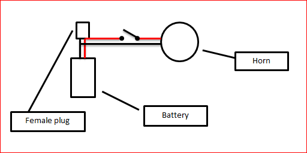

# Super Loud Horn for Your Bike

Source: https://www.instructables.com/Super-Loud-Horn-for-Your-Bike/

---

## Introduction

I wanted to come-up with the loudest horn possible for by motoried push bike without it taking up too much room and also have the batteries rechargable.

The following is the end result.

With this horn I promoise you'll never be worried about a car getting too close again. Just one blast is enough to let those pesky car drivers know that there's a bike close by so beware!

## Step 1: Parts

Below is a list of parts that you'll need to build your own horn:

1. 12 V battery. I used a small Century PS1208 battery
2. Motorbike Horn - you can get these on email cheaply
3. SPST switch
4. Wire
5. Project box
6. male/female connector

## Step 2: Step 1 - Adding the Horn to the Bike

Now you have all of the parts you will need to work out the best spot to put the horn. I decided that the horn would sit nicely above the front brake. Below are the steps to attach it to the bike.

Steps

1. Remove the brake caliper
2. Adjust the horn bracket if necessary. I had to give it a couple of bends to ensure it would fit properly - see below.
3. You can use the bolt that the caliper attaches to the bike to hold the bracket in place

It's then a simple job of attaching the calpier back on with the horn bracket attached.

## Step 3: Step - 2 Wiring-up the Battery Switch and Horn

The next step involves wiring-up the battery so you can charge it, and also adding the switch to be able to use your horn

Wiring battery

1. You will need to add a female plug to the battery (and the male end to a battery charger). - see below.
2. You will also need to add some wires from the plug to the switch and horn. Make sure that these wires are longer than needed as you will need to position the battery on the bike and might need the length.
3. Next place the battery into a project box. You will need to cut-out a small section for the female plug to stick out of. Make sure everything fits nice and snug.

Wiring switch

1. To add the switch I decided to drill 2 holes in the handle bar so i could hide the wires. It's up to you if you want to do this or not.
2. Here's the tricky bit - you will need to thread the wire for the switch through the bars and try and coax it out the other end. i tried a few different methods, but the one that worked best was attaching some string to the wire and threading it through with this.
3. Once through, wire-up the switch and attach it to the handlebars.
4.

## Step 4: Step 4 - Attaching Everything to Your Bike

Now the fun part! Wiring everything up.

1. Find the best spot on your bike to attach the project box with battery inside. I attached mine with cable ties.
2. Attach all of the wires from the switch to the horn and battery (see schematic - step 3)
3. Now block your ears and push the switch.

I have had mine running for 6 months and haven't had to charge up yet.

in regards to the charger - I use a standard 12 v battery charger. I added some extra wires and added the male plug so all I have to do is plug it into the female plug, charge it up and away I go.

Have fun building.

---
*19 images archived*
