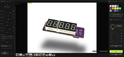
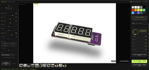
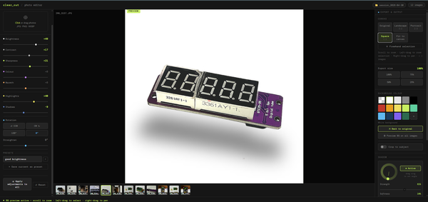
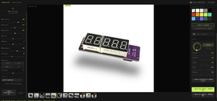

# The Ultimate Photo Editing Tool - Made for Instrucables

Source: https://www.instructables.com/The-Ultimate-Photo-Editing-Tool-Made-for-Instrucab/

---

## Introduction

## Supplies

Everything you need is free and runs entirely in your browser — no installs, no sign up, nothing to download.- A modern web browser (Chrome recommended)- Your photos (JPG, PNG, or WebP)- That's it!Open the editor here: https://lonesoulsurfer.github.io/clear-cut-photo-editor/Full source code and documentation available on GitHub: https://github.com/lonesoulsurfer/clear-cut-photo-editor

## Step 1: Starting a Session

STEP 1When you open the editor you'll be prompted to start a new session or resume a previous one.New session — starts fresh with a clean workspace. Give it a name or leave the default (auto-named by date)Resume — picks up where you left off, including the folder you were working fromClick "Choose Photos folder & start" to select your working folder and beginFiles are saved to Photos / [session name] / inside the folder you choose.You'll then enter the photo editor screen

## Step 2: Loading Images to the Editor

STEPSClick or drag photos directly onto the drop zone in the preview area. Supports JPG, PNG, and WebP. You can load multiple images at once.Once loaded, images appear in the filmstrip at the bottom of the preview. Click any thumbnail to switch to it. Hover a thumbnail to reveal the X remove button.You can move through the filmstrip by either using the arrow keys on your keyboard or use your mouse and click on the arrow symbols on either side of the imageTip: When you add new images, any slider adjustments you've already made are automatically inherited by the new images.

## Step 3: Adjustment Controls

STEPS:The right panel contains all tone and colour controls.Brightness  — Overall exposure. Push up to lift the image, pull down to darken.Contrast    — Separation between lights and darks.Sharpness   — Edge crispness. Useful for product shots.Colour      — Saturation. Pull left to desaturate, push right to boost.Warmth      — Colour temperature. Orange/warm vs blue/cool.Highlights  — Recover blown highlights or push them brighter.Shadows     — Lift or crush the shadow areas independently.All sliders default to 0. The value badge turns accent-coloured when a slider is active.ROTATION & STRAIGHTENBelow the sliders, four buttons handle 90° rotation (CCW, CW, 180°, reset to 0°). The Straighten slider fine-tunes tilt from -45° to +45°.PRESETSSave your current slider state as a named preset so you can reuse it across projects.Dial in the adjustments you wantType a name in the preset field and click "+ Save current as preset"Click any saved preset to instantly apply it to the current imageClick X on a preset to delete itPresets are saved to your browser's local storage and persist between sessions.APPLY TO ALL & RESETApply adjustments to all — copies the current image's slider settings across every image in the sessionReset — zeros out all sliders and rotation for the current imageUNDO / REDOEach image has its own undo/redo history. Use the Undo and Redo buttons above the drop zone.

## Step 4: Mouse Controls

STEP 7:Use your mouse to navigate, zoom, and crop within the preview area.  This is how you enlarge/reduce the size of the image and also centre itZoom in / out — Scroll wheel over the previewPan — Right-click and dragFreehand crop — Left-click and drag to draw a crop regionZoom to selection — Left-drag then release — the canvas zooms to fit your selectionNext / Prev image — Hover the left or right edge of the preview for arrow navigationTip: When in freehand selection mode, the canvas ratio tooltip at the bottom shows the pixel dimensions of your selection as you drag. Release to confirm the crop.

## Step 5: Removing the Background

STEPS:Before you commit and save a colour background, you can do a preview.  The default colour is white but you can change this to any of the colours you want once the preview has beenprocessedChoose what background to place behind a subject after background removal.Pick from the preset swatches (including transparent), or click the + tile to choose a custom colour. The label below the swatches shows your current selection.Options include:Transparent (exports as PNG with no background)White, light grey, mid grey, blackA range of colours including red, amber, yellow, lime, teal, sky, navy, purple, and forest greenCustom colour — click the + swatch and use the colour picker to choose any colour you likeSee a previewHit the preview buttonyou will need to wait about 15 seconds for the background to be removedHit the 'Preview BG on all images' to add the background removal on all of the film stack images you have added.

## Step 6: Adding a Shadow Effect

STEPS:After background removal, the Shadow panel lets you add a realistic drop shadow to your subject.enable the shadow applicationYou will see a shadow appear instantly under the image.  This now can be adjusted to suit the image by using the controlsControlsDrag the angle dial to set the direction the light is coming fromUse the sliders to refine the look:Strength — Opacity of the shadoWSoftness — How blurred/feathered the edges areSpread — How far the shadow extends outwardWidth — Horizontal scale of the shadowDistance — How far the shadow is offset from the subjectClick "Disabled" to toggle the shadow on or offApplying Shadows to the Other ImagesOnce you're happy with the shadow,uou can click "Apply background & shadow to all" to push these settings across every image in the session.  However you don't have to do this and can add a shadow to each image individually if you likeIf you do apply to all and don't like the look of a particular shadow, then you can use the controls to adjust or just turn of shadow for that particular image

## Step 7: Collage Images

STEPS:Switch to Collage mode by clicking the Collage tab at the top of the screen. Your loaded images stay available in the filmstrip at the bottom.Choosing a LayoutThe left panel shows a grid of layout options — click any icon to select itUse the Gap slider to set the spacing between images in pixels.  The colour you pick will also create a frame around the saved images.Choose a gap colour using the White / Black / Grey buttons — this is the colour shown between and around your imagesAssigning Images to SlotsClick a slot in the canvas to select it — it will highlight with a coloured borderThe filmstrip thumbnails at the bottom will glow to show they are ready to assignClick any thumbnail in the filmstrip to assign that image to the selected slotRepeat for each slot in the layoutOnce assigned, scroll to zoom and right-drag to pan within each slot to frame the image exactly how you want itAdjusting Each ImageThe adjustments work exactly the same as when in editor mode.  same with removing backgrounds, adding shadows etc.SavingClick Save collage to export the full layout as a single imageIf you want to keep the original backgrounds on all images, click Save collage (keep all BGs) instead — all adjustments are applied but no background removal is runIf any slot uses a transparent background, the collage will automatically export as PNG to preserve the transparencyStarting OverClick Start over (keep images) at the bottom of the left panel to clear all slot assignments, adjustments, background removals and shadowsYour filmstrip images stay loaded and ready to re-assign to a fresh layoutTo reset a single slot only, select it and click Reset

## Step 8: Export & Output

STEPS:The right panel controls canvas size and export resolution.CANVASChoose the output aspect ratio for your image:Original — keeps the image's native dimensionsLandscape 3:2 — standard landscape cropPortrait 2:3 — standard portrait cropSquare 1:1 — square crop, great for product listingsFit to canvas — fits the image within the canvas without croppingFreehand selection — drag on the preview to define a custom crop regionEXPORT SIZESet the output resolution at 100%, 75%, 50%, or 25% of the canvas size. Use a lower percentage to reduce file size for web use.If you are publishing to Instrcutables and used your photo to take images, then I would suggest reducing the size down to 75%

## Step 9: Saving Your Images to a Folder

SAVINGWhen you're happy with your edits, save your image using the buttons at the bottom of the right panel.Save this photo + Remove BG — exports the current image with all adjustments and background removal appliedSave all photos — batch exports every image in the filmstrip. A progress bar tracks the queue so you can see how it's going.Exports are saved directly to your session folder. If background removal was applied, images export as PNG to preserve transparency — unless you chose a solid background colour, in which case they export as JPG.

---
*32 images archived*
