# The Ultimate Photo Editing Tool - Made for Instrucables

Source: https://www.instructables.com/The-Ultimate-Photo-Editing-Tool-Made-for-Instrucab/

---

## Introduction

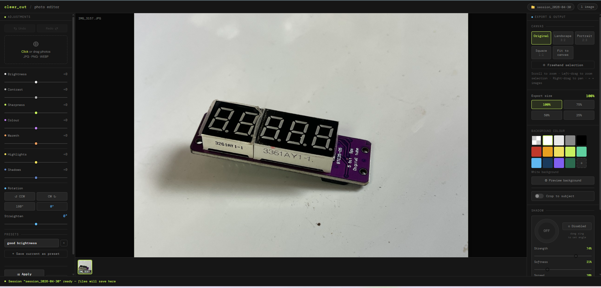

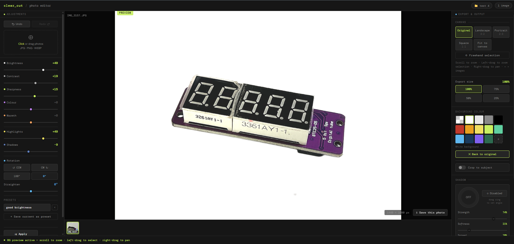

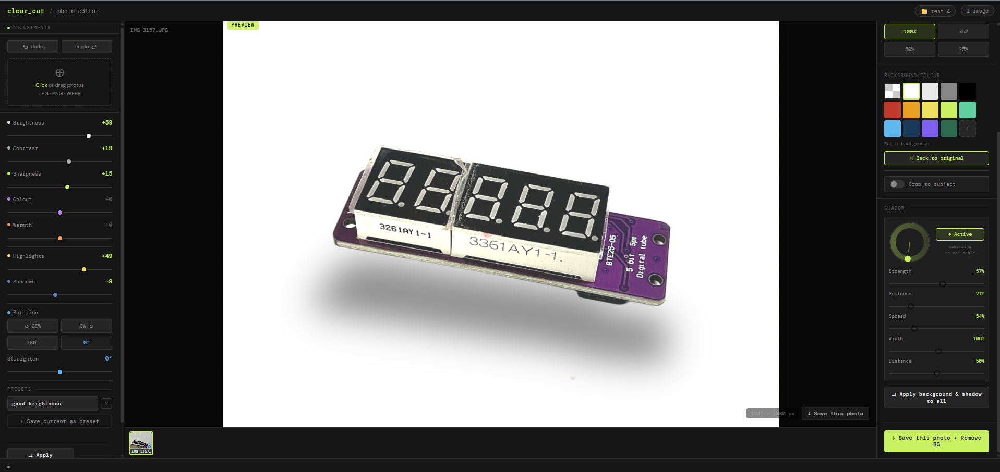

Clear Cut Photo Editor

This is my dream photo editor I wish I had when I first started publishing Instrcutables!

Instead of waiting around for it to be built by someone else (maybe) - I made it myself!

The photo editor, which I have named Clear Cut, was built to make batch changes on images simple and easy. Primarily — I made it so I could batch process images for Instructables builds. However, it's a great tool to use for individual images as well.

The 2 main highlights in this editor are the background removal and adding shadows to images. Once the background has been removed, you can pick the colour you want or have it transparent.

There are multiple controls to help with adjusting the image so it looks just right. Again, these are simple to use and you can also add a preset to your favourite adjustments to use in other editing projects.

I've kept the tools to a minimum and have made a concerted effort not to include any controls that just waste space or are hardly ever used.

## Supplies

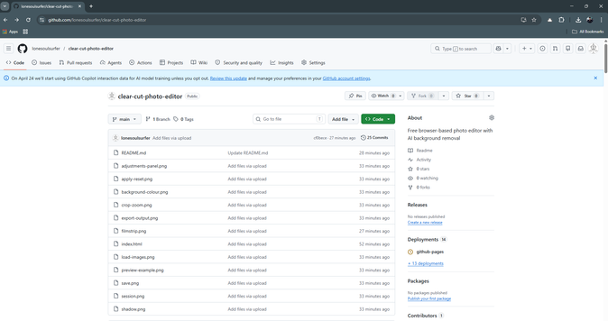

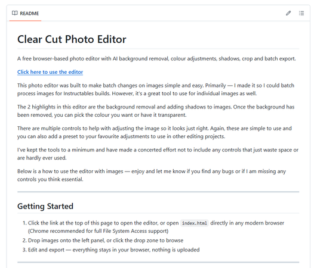

Everything you need is free and runs entirely in your browser — no installs, no sign up, nothing to download.

- A modern web browser (Chrome recommended)

- Your photos (JPG, PNG, or WebP)

- That's it!

Open the editor here: [https://lonesoulsurfer.github.io/clear-cut-photo-editor/](https://lonesoulsurfer.github.io/clear-cut-photo-editor/)

Full source code and documentation available on GitHub: [https://github.com/lonesoulsurfer/clear-cut-photo-editor](https://github.com/lonesoulsurfer/clear-cut-photo-editor)

## Step 1: Starting a Session

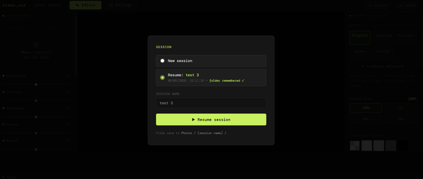

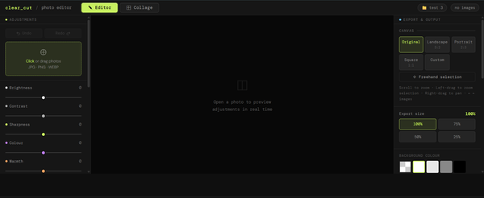

STEP 1

When you open the editor you'll be prompted to start a new session or resume a previous one.

- New session — starts fresh with a clean workspace. Give it a name or leave the default (auto-named by date)
- Resume — picks up where you left off, including the folder you were working from
- Click "Choose Photos folder & start" to select your working folder and begin
- Files are saved to Photos / [session name] / inside the folder you choose.
- You'll then enter the photo editor screen

## Step 2: Loading Images to the Editor

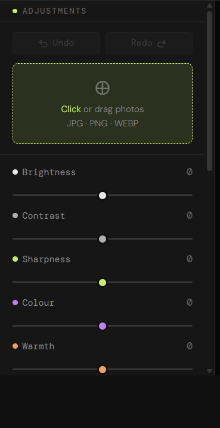

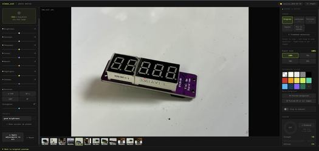

STEPS

- Click or drag photos directly onto the drop zone in the preview area. Supports JPG, PNG, and WebP. You can load multiple images at once.
- Once loaded, images appear in the filmstrip at the bottom of the preview. Click any thumbnail to switch to it. Hover a thumbnail to reveal the X remove button.
- You can move through the filmstrip by either using the arrow keys on your keyboard or use your mouse and click on the arrow symbols on either side of the image
Tip: When you add new images, any slider adjustments you've already made are automatically inherited by the new images.

## Step 3: Adjustment Controls

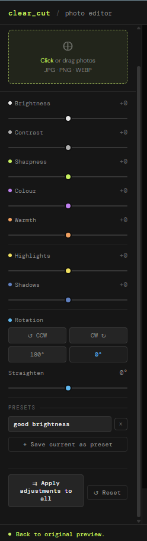

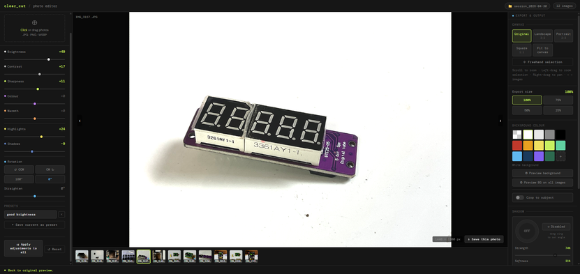

STEPS:

The right panel contains all tone and colour controls.

- Brightness  — Overall exposure. Push up to lift the image, pull down to darken.
- Contrast    — Separation between lights and darks.
- Sharpness   — Edge crispness. Useful for product shots.
- Colour      — Saturation. Pull left to desaturate, push right to boost.
- Warmth      — Colour temperature. Orange/warm vs blue/cool.
- Highlights  — Recover blown highlights or push them brighter.
- Shadows     — Lift or crush the shadow areas independently.
- All sliders default to 0. The value badge turns accent-coloured when a slider is active.
ROTATION & STRAIGHTEN

- Below the sliders, four buttons handle 90° rotation (CCW, CW, 180°, reset to 0°). The Straighten slider fine-tunes tilt from -45° to +45°.
PRESETS

Save your current slider state as a named preset so you can reuse it across projects.

- Dial in the adjustments you want
- Type a name in the preset field and click "+ Save current as preset"
- Click any saved preset to instantly apply it to the current image
- Click X on a preset to delete it
Presets are saved to your browser's local storage and persist between sessions.

APPLY TO ALL & RESET

- Apply adjustments to all — copies the current image's slider settings across every image in the session
- Reset — zeros out all sliders and rotation for the current image
UNDO / REDO

- Each image has its own undo/redo history. Use the Undo and Redo buttons above the drop zone.

## Step 4: Mouse Controls

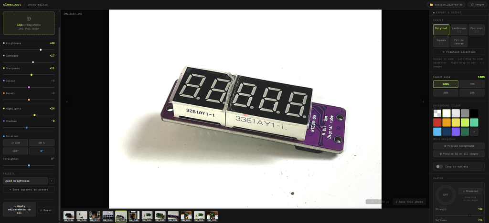

STEP 7:

Use your mouse to navigate, zoom, and crop within the preview area. This is how you enlarge/reduce the size of the image and also centre it

- Zoom in / out — Scroll wheel over the preview
- Pan — Right-click and drag
- Freehand crop — Left-click and drag to draw a crop region
- Zoom to selection — Left-drag then release — the canvas zooms to fit your selection
- Next / Prev image — Hover the left or right edge of the preview for arrow navigation
Tip: When in freehand selection mode, the canvas ratio tooltip at the bottom shows the pixel dimensions of your selection as you drag. Release to confirm the crop.

## Step 5: Removing the Background

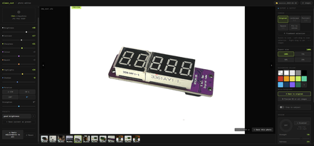

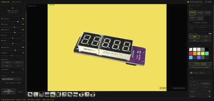

STEPS:

Before you commit and save a colour background, you can do a preview. The default colour is white but you can change this to any of the colours you want once the preview has beenprocessed

- Choose what background to place behind a subject after background removal.
- Pick from the preset swatches (including transparent), or click the + tile to choose a custom colour. The label below the swatches shows your current selection.
Options include:

- Transparent (exports as PNG with no background)
- White, light grey, mid grey, black
- A range of colours including red, amber, yellow, lime, teal, sky, navy, purple, and forest green
- Custom colour — click the + swatch and use the colour picker to choose any colour you like
See a preview

- Hit the preview button
- you will need to wait about 15 seconds for the background to be removed
- Hit the 'Preview BG on all images' to add the background removal on all of the film stack images you have added.

## Step 6: Adding a Shadow Effect

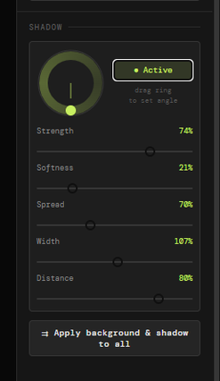

STEPS:

After background removal, the Shadow panel lets you add a realistic drop shadow to your subject.

- enable the shadow application
- You will see a shadow appear instantly under the image.  This now can be adjusted to suit the image by using the controls
Controls

- Drag the angle dial to set the direction the light is coming from
- Use the sliders to refine the look:
- Strength — Opacity of the shadoW
- Softness — How blurred/feathered the edges are
- Spread — How far the shadow extends outward
- Width — Horizontal scale of the shadow
- Distance — How far the shadow is offset from the subject
- Click "Disabled" to toggle the shadow on or off
Applying Shadows to the Other Images

- Once you're happy with the shadow,uou can click "Apply background & shadow to all" to push these settings across every image in the session.
- However you don't have to do this and can add a shadow to each image individually if you like
- If you do apply to all and don't like the look of a particular shadow, then you can use the controls to adjust or just turn of shadow for that particular image

## Step 7: Collage Images

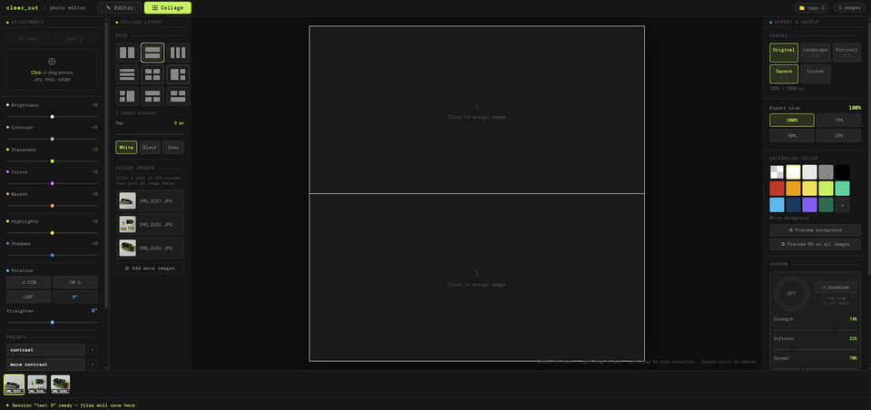

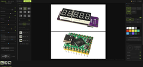

STEPS:

Switch to Collage mode by clicking the Collage tab at the top of the screen. Your loaded images stay available in the filmstrip at the bottom.

Choosing a Layout

- The left panel shows a grid of layout options — click any icon to select it
- Use the Gap slider to set the spacing between images in pixels.  The colour you pick will also create a frame around the saved images.
- Choose a gap colour using the White / Black / Grey buttons — this is the colour shown between and around your images
Assigning Images to Slots

- Click a slot in the canvas to select it — it will highlight with a coloured border
- The filmstrip thumbnails at the bottom will glow to show they are ready to assign
- Click any thumbnail in the filmstrip to assign that image to the selected slot
- Repeat for each slot in the layout
- Once assigned, scroll to zoom and right-drag to pan within each slot to frame the image exactly how you want it
Adjusting Each Image

- The adjustments work exactly the same as when in editor mode.  same with removing backgrounds, adding shadows etc.
Saving

- Click Save collage to export the full layout as a single image
- If you want to keep the original backgrounds on all images, click Save collage (keep all BGs) instead — all adjustments are applied but no background removal is run
- If any slot uses a transparent background, the collage will automatically export as PNG to preserve the transparency
Starting Over

- Click Start over (keep images) at the bottom of the left panel to clear all slot assignments, adjustments, background removals and shadows
- Your filmstrip images stay loaded and ready to re-assign to a fresh layout
- To reset a single slot only, select it and click Reset

## Step 8: Export & Output

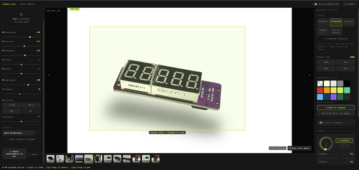

STEPS:

The right panel controls canvas size and export resolution.

CANVAS

Choose the output aspect ratio for your image:

- Original — keeps the image's native dimensions
- Landscape 3:2 — standard landscape crop
- Portrait 2:3 — standard portrait crop
- Square 1:1 — square crop, great for product listings
- Fit to canvas — fits the image within the canvas without cropping
- Freehand selection — drag on the preview to define a custom crop region
EXPORT SIZE

- Set the output resolution at 100%, 75%, 50%, or 25% of the canvas size. Use a lower percentage to reduce file size for web use.
- If you are publishing to Instrcutables and used your photo to take images, then I would suggest reducing the size down to 75%

## Step 9: Saving Your Images to a Folder

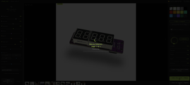

SAVING

When you're happy with your edits, save your image using the buttons at the bottom of the right panel.

- Save this photo + Remove BG — exports the current image with all adjustments and background removal applied
- Save all photos — batch exports every image in the filmstrip. A progress bar tracks the queue so you can see how it's going.
Exports are saved directly to your session folder. If background removal was applied, images export as PNG to preserve transparency — unless you chose a solid background colour, in which case they export as JPG.

---
*32 images archived*
