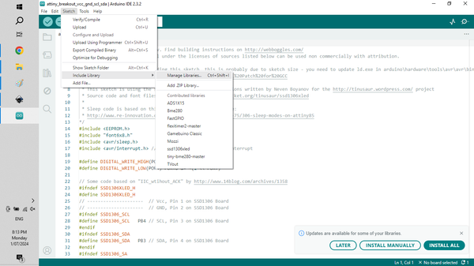
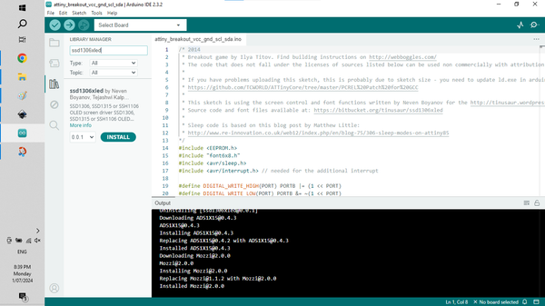
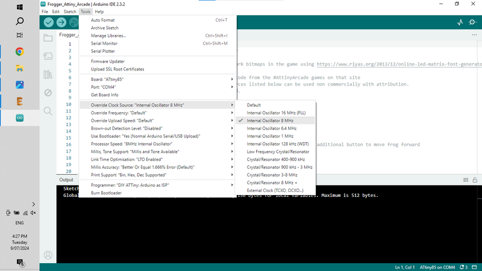

# Tiny Arcade Game - Attiny85 Build

Source: https://www.instructables.com/Tiny-Arcade-Game-Attiny85/

---

## Introduction

Hello beautiful people.

I've recently taken the leap into playing around with microcontrollers, specifically the 8 bit ATtiny85 and so far it's been a blast!

This Instructable goes through step by step how to build your own tiny arcade game. There are 7 different games that you can play and I've also created a custom keyring style mini PCB to add the components to.

For those new to ATtiny microcontrollers, It is a small, integrated, 8 pin IC, similar to the Arduino, but with much less IO pins, smaller memory and a smaller form factor. Don't let the smallness of the IC fool you, ATtiny85 microcontroller can perform a whole bunch of different functions on a single IC once it has been programmed. In this project we will be programming it with some arcade games.

Don't worry if you a totally new to all of this. I have created this project with beginners in mind so if you have some basic soldering skills and a computer you shouldn't have any issues building your own. I've used through hole components and off-the-shelf parts which you can buy cheaply from Ali-Express (or whoever you buy electronic components from). I've included links to all of the parts in the next step.

You will need to learn how to program the ATtiny as well. To make this as easy as possible, I've published an Instructable on this which you can find in step 3. I wanted to ensure that this Instructable had everything you needed to make your own.

The games available are your classic arcade games like Frogger, Space Attack, Breakout, Snake, Pong, and others. It still blows my mind that you can fit a whole game into one of these tiny IC's!

Check out the vid which shows the games in action.

Let's get building!

## Supplies

The following parts list is for the Mini Arcade components. Step 2 has all of the information needed to program the ATtiny.

You will get 5 PCB's when you have them printed so you may as well ensure that you order enough parts to build 5!

Parts:

1. PCB - See next step on how to get them printed
2. ATtiny85 X 1 - [Ali Express](https://www.aliexpress.com/w/wholesale-attiny-85.html?spm=a2g0o.home.search.0). Tip - Buy them in lots of 5 - it's cheaper and you can always use them in more games. Make sure you buy 'through hole' IC's
3. OLED Display Module (SSD1306) - [Ali Express](https://www.aliexpress.com/w/wholesale-ssd1306.html?spm=a2g0o.productlist.auto_suggest.1.485dIfbVIfbV3y) Buy the single colour ones. Mine are white OLED but you can get them in blue as well.
4. Buzzer (speaker) - [Ali Express](https://vi.aliexpress.com/w/wholesale-buzzer.html?spm=a2g0o.productlist.search.0). I used the low profile ones like this [Ali Express](https://vi.aliexpress.com/item/1005001482792890.html?spm=a2g0o.productlist.main.75.5adcbd8bCCTMlz&algo_pvid=0e8d47a8-60d0-4b2d-87c9-71356b422f0a&algo_exp_id=0e8d47a8-60d0-4b2d-87c9-71356b422f0a-37&pdp_npi=4%40dis%21AUD%210.56%210.42%21%21%210.37%210.28%21%402103011217200734707541728efb30%2112000034752671980%21sea%21AU%21135072183%21&curPageLogUid=43CnMJA5BeLo&utparam-url=scene%3Asearch%7Cquery_from%3A)
5. Resistors - metal film 1% - [Ali Express](https://vi.aliexpress.com/w/wholesale-metal-film-1%25-resistor.html?spm=a2g0o.productlist.search.0)
6. 10K X 2
7. 1K X 1
8. 6.8K X 1
9. Momentary Tactile Push Button X 3 - [Ali Express](https://vi.aliexpress.com/w/wholesale-momentary-tactile-switch.html?spm=a2g0o.productlist.search.0).
10. Micro on/off switch vertical - [Ali Express](https://vi.aliexpress.com/item/33009763749.html?spm=a2g0o.productlist.main.117.7d584bf4qy5kxl&algo_pvid=2856a2f1-9154-44d6-9079-86c2dd5eb6c0&algo_exp_id=2856a2f1-9154-44d6-9079-86c2dd5eb6c0-58&pdp_npi=4%40dis%21AUD%211.99%211.07%21%21%211.32%210.71%21%402103011217200738046484689efb30%2167133660852%21sea%21AU%21135072183%21&curPageLogUid=7Thx4wRXnAoy&utparam-url=scene%3Asearch%7Cquery_from%3A) you can also use these types as well - [Ali Express](https://vi.aliexpress.com/w/wholesale-On%252FOff-SPDT-Pin-PCB-Vertical.html?spm=a2g0o.detail.search.0)
11. CR2032 battery holder X 1 - [Ali Express](https://vi.aliexpress.com/item/4001240194584.html?spm=a2g0o.productlist.main.1.48322325Rouix5&algo_pvid=a1d8fd77-c144-48f6-be76-218ff5d9b9a5&algo_exp_id=a1d8fd77-c144-48f6-be76-218ff5d9b9a5-0&pdp_npi=4%40dis%21AUD%213.61%213.61%21%21%212.39%212.39%21%402103011217200739359075738efb30%2110000015424733532%21sea%21AU%21135072183%21&curPageLogUid=flleZ6i7IOKX&utparam-url=scene%3Asearch%7Cquery_from%3A)
12. CR2032 Battery - [Ali Express](https://vi.aliexpress.com/w/wholesale-cr2032-battery.html?spm=a2g0o.productlist.search.0)

## Step 1: The PCB & Schematic

Firstly, all the files that you need to get the circuit board printed can be found in my [GitHub Page](https://github.com/lonesoulsurfer/Tiny_Arcade_Games). I've also included the Eagle files for the schematic and the board in my Google Drive so you can play around with these if you want to.

You’ll need to send the Gerber files to a PCB manufacturer like [JLCPCB](https://jlcpcb.com/?from=VGBA&gad_source=1&gclid=CjwKCAiAjfyqBhAsEiwA-UdzJCxT2LUX1iS0CvS4HVuZlxetrU2JQNyu0nueQUivgEq7MzfoGlH54RoClQ8QAvD_BwE) (Not affiliated) who will print the boards for you. Jump into my Google Drive link, download the Gerber file to your computer and then send them off to your PCB manufacturer of choice. Make sure you keep it zipped.

I've put together an Instructable on how to get your broads printed which you can find [here](https://www.instructables.com/How-to-Get-a-PCB-Printed-Using-Gerber-Files/).

NOTE: The manufacture will include an order number on the PCB. However, you can 'specify a location' once the Gerber files have been loaded. Click 'specify a location' when the board has been loaded and the manufacturer will add it to the back where I have indicated.

## Step 2: Adding the Components to the PCB

The component list is quite low and as mentioned, I've only used through hole components (no SMD) so it's super simple to solder everything in place. Note that the PCB is double sided and the battery holder and on/off switch is added to the back of the PCB. The order that you add the components is important. If you add the OLED module before the battery holder you won't be able to get to the solder points for the battery holder so pay attention to the following steps

STEPS:

1. As usual it's best to start with the lowest profile components which in this case is the resistors. These have been added to the PCB so they are hidden by the OLED module and also act as supports for the module. Solder these in place.
2. Next solder the tactile switches into place
3. You can now solder the programmed IC into place. If you add a IC socket you can always easily remove the ATtiny and re-program it with other games. It also allows you to remove the ATtiny if something goes wrong with the programming. I like to test the ATtiny first via a breadboard to make sure it is working correctly before soldering it into place.
4. Now solder the buzzer (speaker) into place.
5. Before you solder the OLED module, flip the PCB and solder into place the battery holder and on/off switch.
6. Now you can solder the OLED into place.
7. Add a battery to the back and turn on the game to make sure everything works.

## Step 3: Programming the ATtiny85

When I first started to investigate and learn how to program the ATtiny I was totally confused! The tutorials that I found on line didn't give a complete step by step guide and I had to work my way through a number of them to finally work out how to do it. Luckily for you I've recently put together an Instructable on exactly how to do this and it really isn't that hard.

You will however need to get yourself an Arduino Uno which you'll need to program the ATtiny. Again, I want to reiterate that this really isn't hard to do and if you follow the Instructable below you will be able to program your ATtiny with any of the games included in this Instructable

[How to Program ATtiny with an Arduino](https://www.instructables.com/How-to-Program-a-ATtiny-With-Arduino/)

Once you know how to program an ATtiny, you are ready to install one of the games onto it.

## Step 4: Programming a Game on the ATtiny85 - Step 1

Now that you know how to program the ATtiny, it's time to try and add one of the games I have included. All of the games can be found in my [GitHub Page](https://github.com/lonesoulsurfer/Tiny_Arcade_Games) in the 'Tiny Arcade - Games' folder and have been fully tested and work perfectly.

You will need to add a library to the Arduino. This couldn't be easier. As a matter of fact, Arduino have included a number of libraries that you just need to install directly from Arduino IDE. The library is needed so the ATtiny can drive the OLED screen

STEPS:

1. In Arduino IDE go to Sketch / Include Libraries / Manage Libraries
2. Type the following in the search bar - ssd1306xledwhich will bring up the sketch and then hit install.
3. That's it! You have now added the library for the OLED module and there is nothing further to so.
4. Now you can open the sketch for whatever game you want to program to the ATtiny and upload it via Arduino.
5. Just click onto the sketch which will open Arduino and follow the steps above to load the game to the ATtiny.

## Step 5: Programming a Game on the ATtiny85 - Step 2

Now that you have added the sdd1306xled library - you need to change a couple things under Tools to make suree everything works ok. If you don't do this then you might find that the games restart constantly.

STEPS:

1. In the game sketch that you have opened go to: Tools / Override Clock Source and click on 'Internal Oscillator 8Mhz
2. Next go to: Tools / Processor speed and click on 8Mhz Internal Ocsillator
3. Lastly, go to: Tools / Brown Out Detection Level and click 1.8V. Actually not 100% sure you need to do this but it won't hurt
4. Now you can upload the sketch into the ATtiny85.

## Step 6: Playing the Game

Most of the games are quite simple to play so you don't really need instructions on how to play them. I have included the instructions on how to play in the next step.

I haven't included Pacman or Tetris in this build. They are available but Pacman needs some additional steps and I didn't want to confuse anyone. Tetris uses a different style OLED so that's for another build.

If you are looking for other games then just do a search on Google for ATtiny85 games and see what you can find. Make sure you test them on a breadboard first before committing them to a PCB.

A lot of the games only use 2 buttons but I have included 3 (left, jump, right) so you can play multiple games on the one board

That's it! Build a bunch more using the other games and give them away to your friends and family.

## Step 7: Game Instructions

Bat Bonanza

Bat bonanza is a clone of the classic pong

1. Pressing and releasing the left button cycles through modes, including two-player games and one-player modes with varying degrees of difficulty.
2. Also, from standby, press and hold the left button to reset all settings

Breakout

1. Use the left and right buttons to control the paddle at the bottom of the screen

Frogger

1. Use the left & right buttons move the frog across the screen
2. The middle button moves the frog forward
3. From standby, press and hold left button to turn sound on and off
4. From standby, press and hold left button with the right button held to reset high score

Run Dude run

1. LEFT and RIGHT buttons move the little dude. Just don't let any missiles hit you!

Snake

1. Classic snake game which only uses the left button to control the snake

Space Attack

1. LEFT and RIGHT buttons move the spaceship
2. Middle button to fire
3. From standby, press and hold left button to turn sound on and off
4. Press and hold left button with the right button held to reset high score

UFO & Stacker - 2 games on one ATtiny

1. To play Stacker - press and release left button
2. To play UFO - with the right button held, press and release left button
3. To turn sound on and off - press and HOLD left button
4. To reset high scores to zero - whilst HOLDING the right button, press and HOLD the left button

---
*37 images archived*
