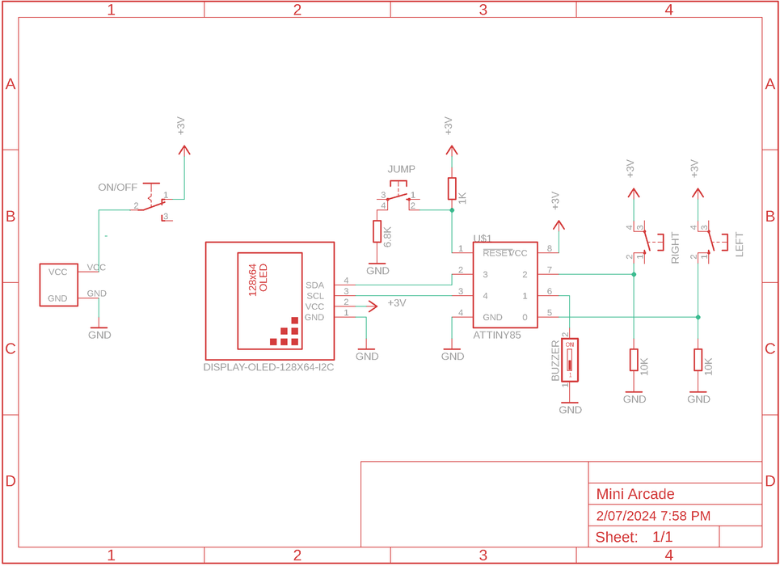
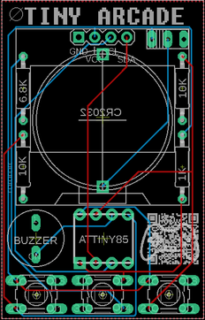
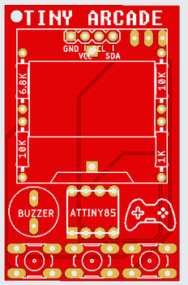
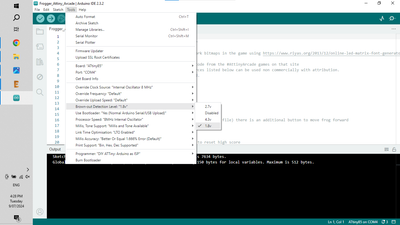

# Tiny Arcade Game - Attiny85 Build

Source: https://www.instructables.com/Tiny-Arcade-Game-Attiny85/

---

## Introduction

## Supplies

The following parts list is for the Mini Arcade components. Step 2 has all of the information needed to program the ATtiny.You will get 5 PCB's when you have them printed so you may as well ensure that you order enough parts to build 5!Parts:PCB - See next step on how to get them printedATtiny85 X 1 - Ali Express. Tip - Buy them in lots of 5 - it's cheaper and you can always use them in more games. Make sure you buy 'through hole' IC'sOLED Display Module (SSD1306) - Ali Express Buy the single colour ones. Mine are white OLED but you can get them in blue as well.Buzzer (speaker) - Ali Express. I used the low profile ones like this Ali ExpressResistors - metal film 1% - Ali Express10K X 21K X 16.8K X 1Momentary Tactile Push Button X 3 - Ali Express.Micro on/off switch vertical - Ali Express you can also use these types as well - Ali ExpressCR2032 battery holder X 1 - Ali ExpressCR2032 Battery - Ali Express

## Step 1: The PCB & Schematic

Firstly, all the files that you need to get the circuit board printed can be found in my GitHub Page. I've also included the Eagle files for the schematic and the board in my Google Drive so you can play around with these if you want to.You’ll need to send the Gerber files to a PCB manufacturer like JLCPCB (Not affiliated) who will print the boards for you. Jump into my Google Drive link, download the Gerber file to your computer and then send them off to your PCB manufacturer of choice. Make sure you keep it zipped.I've put together an Instructable on how to get your broads printed which you can find here.NOTE: The manufacture will include an order number on the PCB. However, you can 'specify a location' once the Gerber files have been loaded. Click 'specify a location' when the board has been loaded and the manufacturer will add it to the back where I have indicated.

## Step 2: Adding the Components to the PCB

The component list is quite low and as mentioned, I've only used through hole components (no SMD) so it's super simple to solder everything in place. Note that the PCB is double sided and the battery holder and on/off switch is added to the back of the PCB. The order that you add the components is important. If you add the OLED module before the battery holder you won't be able to get to the solder points for the battery holder so pay attention to the following stepsSTEPS:As usual it's best to start with the lowest profile components which in this case is the resistors. These have been added to the PCB so they are hidden by the OLED module and also act as supports for the module. Solder these in place.Next solder the tactile switches into placeYou can now solder the programmed IC into place. If you add a IC socket you can always easily remove the ATtiny and re-program it with other games. It also allows you to remove the ATtiny if something goes wrong with the programming. I like to test the ATtiny first via a breadboard to make sure it is working correctly before soldering it into place.Now solder the buzzer (speaker) into place.Before you solder the OLED module, flip the PCB and solder into place the battery holder and on/off switch.Now you can solder the OLED into place.Add a battery to the back and turn on the game to make sure everything works.

## Step 3: Programming the ATtiny85

When I first started to investigate and learn how to program the ATtiny I was totally confused!  The tutorials that I found on line didn't give a complete step by step guide and I had to work my way through a number of them to finally work out how to do it.  Luckily for you I've recently put together an Instructable on exactly how to do this and it really isn't that hard.You will however need to get yourself an Arduino Uno which you'll need to program the ATtiny.  Again, I want to reiterate that this really isn't hard to do and if you follow the Instructable below you will be able to program your ATtiny with any of the games included in this InstructableHow to Program ATtiny with an ArduinoOnce you know how to program an ATtiny, you are ready to install one of the games onto it.

## Step 4: Programming a Game on the ATtiny85 - Step 1

Now that you know how to program the ATtiny, it's time to try and add one of the games I have included. All of the games can be found in my GitHub Page in the 'Tiny Arcade - Games' folder and have been fully tested and work perfectly.You will need to add a library to the Arduino. This couldn't be easier. As a matter of fact, Arduino have included a number of libraries that you just need to install directly from Arduino IDE. The library is needed so the ATtiny can drive the OLED screenSTEPS:In Arduino IDE go to Sketch / Include Libraries / Manage LibrariesType the following in the search bar - ssd1306xled which will bring up the sketch and then hit install.That's it! You have now added the library for the OLED module and there is nothing further to so.Now you can open the sketch for whatever game you want to program to the ATtiny and upload it via Arduino.Just click onto the sketch which will open Arduino and follow the steps above to load the game to the ATtiny.

## Step 5: Programming a Game on the ATtiny85 - Step 2

Now that you have added the sdd1306xled library - you need to change a couple things under Tools to make suree everything works ok.  If you don't do this then you might find that the games restart constantly.STEPS:In the game sketch that you have opened go to: Tools / Override Clock Source and click on 'Internal Oscillator 8MhzNext go to: Tools / Processor speed and click on 8Mhz Internal OcsillatorLastly, go to: Tools / Brown Out Detection Level and click 1.8V.  Actually not 100% sure you need to do this but it won't hurtNow you can upload the sketch into the ATtiny85.

## Step 6: Playing the Game

Most of the games are quite simple to play so you don't really need instructions on how to play them. I have included the instructions on how to play in the next step.I haven't included Pacman or Tetris in this build. They are available but Pacman needs some additional steps and I didn't want to confuse anyone. Tetris uses a different style OLED so that's for another build.If you are looking for other games then just do a search on Google for ATtiny85 games and see what you can find. Make sure you test them on a breadboard first before committing them to a PCB.A lot of the games only use 2 buttons but I have included 3 (left, jump, right) so you can play multiple games on the one boardThat's it! Build a bunch more using the other games and give them away to your friends and family.

## Step 7: Game Instructions

Bat BonanzaBat bonanza is a clone of the classic pongPressing and releasing the left button cycles through modes, including two-player games and one-player modes with varying degrees of difficulty. Also, from standby, press and hold the left button to reset all settings BreakoutUse the left and right buttons to control the paddle at the bottom of the screenFroggerUse the left & right buttons move the frog across the screenThe middle button moves the frog forwardFrom standby, press and hold left button to turn sound on and offFrom standby, press and hold left button with the right button held to reset high scoreRun Dude runLEFT and RIGHT buttons move the little dude.  Just don't let any missiles hit you!Snake Classic snake game which only uses the left button to control the snakeSpace AttackLEFT and RIGHT buttons move the spaceshipMiddle button to fireFrom standby, press and hold left button to turn sound on and offPress and hold left button with the right button held to reset high scoreUFO & Stacker - 2 games on one ATtinyTo play Stacker - press and release left buttonTo play UFO - with the right button held, press and release left buttonTo turn sound on and off - press and HOLD left buttonTo reset high scores to zero - whilst HOLDING the right button, press and HOLD the left button

---
*37 images archived*
