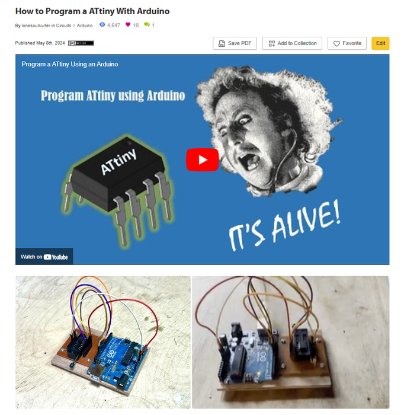

# Tiny Tetris - ATtiny85 Project

Source: https://www.instructables.com/Tiny-Tetris-ATtiny85-Project/

---

## Introduction

Everyone knows and loves Tetris!

Ever wanted a pocket sized Tetris that you could whip out anytime you wanted? Well you are in luck. This build issues an ATTiny85 to run Tetris on an OLED SDD1306 screen. It's tiny but definitely usable and did I mention it's ridiculously fun to play!

I've approached this Instructable with novices in mind so if you have never programmed an ATTiny85 before and want to give it a shot, well now's the time!

I'm here to help, so if you do run into any issues, then just drop a comment below I'll do my best to help you out!

Let's get building

## Supplies

The parts list can also be found on my [GitHub](https://github.com/lonesoulsurfer/Tiny_Tetris) page. The PCB info can be found on the next step

PARTS:

1. ATtiny85 - [Ali Express](https://www.aliexpress.com/w/wholesale-attiny-85.html?spm=a2g0o.home.search.0)
2. Buzzer - [Ali Express](https://vi.aliexpress.com/item/1005001482792890.html?spm=a2g0o.productlist.main.75.5adcbd8bCCTMlz&algo_pvid=0e8d47a8-60d0-4b2d-87c9-71356b422f0a&algo_exp_id=0e8d47a8-60d0-4b2d-87c9-71356b422f0a-37&pdp_npi=4%40dis%21AUD%210.56%210.42%21%21%210.37%210.28%21%402103011217200734707541728efb30%2112000034752671980%21sea%21AU%21135072183%21&curPageLogUid=43CnMJA5BeLo&utparam-url=scene%3Asearch%7Cquery_from%3A)
3. OLED 1306 Screen - [Ali Express](https://www.aliexpress.com/w/wholesale-ssd1306.html?spm=a2g0o.productlist.auto_suggest.1.485dIfbVIfbV3y)
4. Micro switch horizontal slide - [Ali Express](https://vi.aliexpress.com/item/33009763749.html?spm=a2g0o.productlist.main.117.7d584bf4qy5kxl&algo_pvid=2856a2f1-9154-44d6-9079-86c2dd5eb6c0&algo_exp_id=2856a2f1-9154-44d6-9079-86c2dd5eb6c0-58&pdp_npi=4%40dis%21AUD%211.99%211.07%21%21%211.32%210.71%21%402103011217200738046484689efb30%2167133660852%21sea%21AU%21135072183%21&curPageLogUid=7Thx4wRXnAoy&utparam-url=scene%3Asearch%7Cquery_from%3A)
5. Momentary Buttons X 4 The ones I used are about 2mm high - [Ali Express](https://vi.aliexpress.com/w/wholesale-momentary-tactile-switch.html?spm=a2g0o.productlist.search.0)
6. Resistors - [Ali Express](https://vi.aliexpress.com/w/wholesale-metal-film-1%25-resistor.html?spm=a2g0o.productlist.search.0)
7. 2 X 10K
8. 1 X 1K
9. 1 X 2.2K
10. CR2032 battery holder - [Ali Express](https://vi.aliexpress.com/item/4001240194584.html?spm=a2g0o.productlist.main.1.48322325Rouix5&algo_pvid=a1d8fd77-c144-48f6-be76-218ff5d9b9a5&algo_exp_id=a1d8fd77-c144-48f6-be76-218ff5d9b9a5-0&pdp_npi=4%40dis%21AUD%213.61%213.61%21%21%212.39%212.39%21%402103011217200739359075738efb30%2110000015424733532%21sea%21AU%21135072183%21&curPageLogUid=flleZ6i7IOKX&utparam-url=scene%3Asearch%7Cquery_from%3A)
11. CR2032 battery - [Ali Express](https://vi.aliexpress.com/w/wholesale-cr2032-battery.html?spm=a2g0o.productlist.search.0)
12. Optional - Key Chain - [Ali Express](https://vi.aliexpress.com/w/wholesale-key-chain.html?spm=a2g0o.productlist.search.0)

## Step 1: Getting the PCB Printed

Firstly, all the files that you need to get the circuit board printed can be found in my [GitHub Page](https://github.com/lonesoulsurfer/Tiny_Tetris)[.](https://github.com/lonesoulsurfer/Tiny_Tetris) I've also included the Eagle files for the schematic and the board in my GitHub Page so you can play around with these if you want to as well.

You’ll need to send the Gerber files to a PCB manufacturer like [JLCPCB](https://jlcpcb.com/?from=VGBA&gad_source=1&gclid=CjwKCAiAjfyqBhAsEiwA-UdzJCxT2LUX1iS0CvS4HVuZlxetrU2JQNyu0nueQUivgEq7MzfoGlH54RoClQ8QAvD_BwE) (Not affiliated) who will print the boards for you. Download the repository on my GitHub page to your computer and then send the Gerber files off to your PCB manufacturer of choice. Make sure you keep it zipped.

I've put together an Instructable on how to get your broads printed which you can find [here](https://www.instructables.com/How-to-Get-a-PCB-Printed-Using-Gerber-Files/).

NOTE: The manufacture will include an order number on the PCB. However, you can 'specify a location' once the Gerber files have been loaded. Click 'specify a location' and add a note saying - 'please add the order number to the back of the board.

## Step 2: Adding the Components to the PCB

The component list is quite low and as mentioned, I've only used through hole components (no SMD) so it's super simple to solder everything in place. Note that the PCB is double sided and the battery holder and on/off switch is added to the back of the PCB. The order that you add the components is important. If you add the OLED screen before the battery holder you won't be able to get to the solder points for the battery holder so pay attention to the order of the steps

STEPS:

1. As usual, it's best to start with the lowest profile components which in this case is the resistors. These have been added to the PCB so they are hidden by the OLED screen and also act as supports for the screen. Solder these in place.
2. Next solder the tactile switches into place. I have used low profile buttons which I think would well on this PCB.
3. Now solder the buzzer (speaker) into place.
4. Before you solder the OLED screen into place, flip the PCB and solder into place the battery holder and on/off switch.
5. Now you can solder the OLED screen into place.
6. Don't solder in the ATtiny85 yet - we first need to program it

## Step 3: How to Program an ATtiny85

When I first started to investigate and learn how to program the ATtiny85 I was totally confused! The tutorials that I found on line didn't give a complete step by step guide and I had to work my way through a number of them to finally work out how to do it. Luckily for you I've recently put together an Instructable on exactly how to do this and it really isn't that hard.

You will however need to get yourself an Arduino Nano which you'll use to program the ATtiny85. Again, I want to reiterate that this really isn't hard to do and if you follow the Instructable below you will be able to program your ATtiny85 with the Tetris sketch

[How to Program ATtiny85 with an Arduino](https://www.instructables.com/How-to-Program-a-ATtiny-With-Arduino/)

I have also done an Instructable on building your own programmer for the ATtiny85. You can go all out and get a PCB printed or you can just breadboard the programmer.

[Programmer for the ATtiny85](https://www.instructables.com/Programmer-for-ATtiny-85/)

Once you know how to program an ATtiny85, you are ready to install Tetris onto it.

## Step 4: Uploading the Sketch to the ATtiny85

If you don't have the sdd1306xled library added to Arduino IDE - then you will need to add this.

Adding the SDD1306XLED Library to Arduino IDE

1. In Arduino IDE go to Sketch / Include Libraries / Manage Libraries
2. Type the following in the search bar - ssd1306xledwhich will bring up the sketch and then hit install.

Uploading the Tetris Sketch to the ATtiny85

STEPS:

1. Open up the 'ATtiny85-Tetris-Gold IDE file which will open it up in Arduino IDE
2. Ensure that the Arduino is set as 'Arduino as ISP'
3. Go to 'tools' and make sure that the processor speed is set to 8Mhz Internal Oscillator. Also change the Override Clock Source to 'Internal Oscillator 8Mhz'
4. Now select the ATtiny85 in the dropdown and burn the bootloader
5. You can now upload the sketch via 'upload Using Programmer'

CAUTION!

1. If you get a message that says that sketch is too big, then you will need to reduce the size of the sketch. You can do this by changing the following:
2. Tools / Print Support / change to 'Hex Only Support'
3. Tools / Brown Out Detection Level / change to 'Disabled'
4. Now try again to load the sketch. It should be good now to load

## Step 5: Testing the ATtiny85 Before Soldering Into the PCB

I went al out and soldered together a separate PCB so I could test the ATtiny85 before I soldered it into place. The test PCB included a 8 IC socket so I could easily add and remove the ATtiny85. You don't have to do this but It will save you a lot of possible headaches if you find that something went wrong with the programming of the ATtiny85.

You could also just breadboard the circuit as well which is probably just as easy and you won't waste a board! I'm planning to do a few of these so I wanted a more permanent testing board.

## Step 6: Adding the ATtiny85 to the PCB

Final step!

Now that you have tested the ATtiny85 and it works, you can now solder it into place onto the PCB.

STEPS:

1. Place the ATtiny85 into the PCB
2. Add a little solder to one leg to hold it into place
3. Now solder the rest of the legs to the the PCB
4. Add a battery and play away!

Hard Mode and Ghost On

There are a couple of bonus plays that you can activate.

Ghost On.

This adds a ghost piece that makes it a lot easier to position the pieces as they move down the screen. I would highly recommend turning this on when you play

1. Hold down 'drop' and turn on the game
2. push 'left' whist still holding down 'drop' until you see 'Ghost on' appear on the screen
3. now release 'drop' and push it again

It plays an extra long version of the song but it is well worth it

Hard Mode

This adds a whole stack of pieces to the start of the game

1. Hold down 'drop' and turn on the game
2. hold down 'left' whist still holding down 'drop' until you see 'hard mode' appear on the screen
3. now release 'drop' and push it again

---
*25 images archived*
