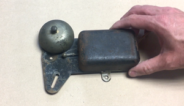
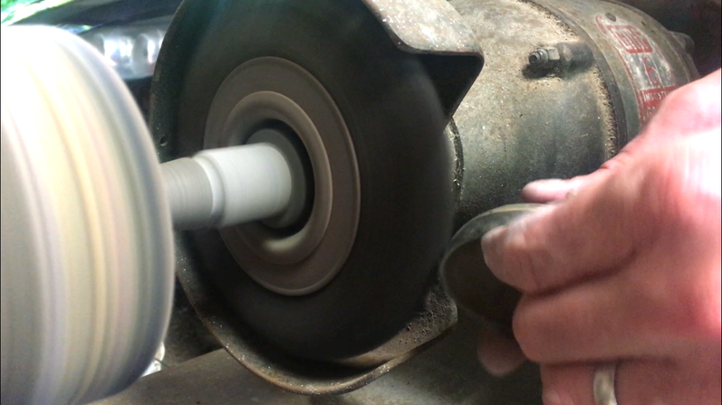
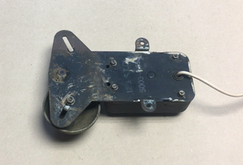
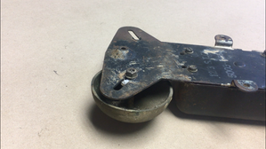
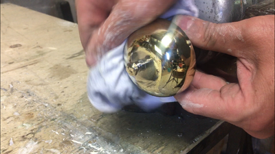
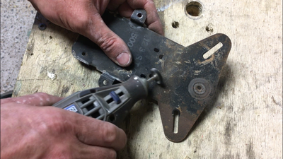
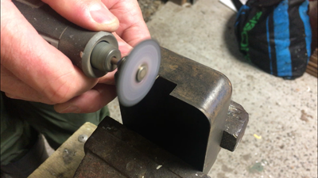
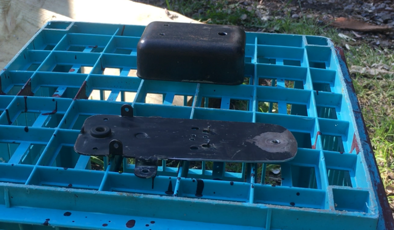
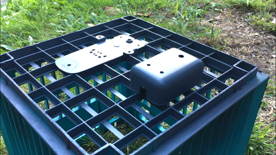
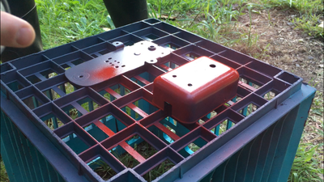

# Wireless Dinner (or Door) Bell

Source: https://www.instructables.com/Wireless-Dinner-or-Door-Bell/

---

## Introduction

My makerspace (which is a very small shed!) is some distance from the house and I wanted some way to know when I'm wanted back in the house. I got a little tired of hearing someone yell from the top of the stairs that dinner is ready, so I built a remote controlled bell.

The build is made from readily available parts and you will need to build a simple 555 circuit as well. For those new to making circuits, I recently completed an 'ible on getting started in building circuits so [check it out here](https://www.instructables.com/id/How-to-Build-Your-1st-Circuit/) if you need help. The circuit I built in the 'ible is the same as the one needed in this one!

How it works is there is a small solenoid that is connected to the 555 circuit. The circuit is activated my the remote which in turn makes the solenoid move up and down, striking the bell. You can control the speed of the solenoid with a potentiometer to either have a nice, slow ring or a manic fast one.

That's enough with the intro - lets get to building.

## Step 1: Parts and Tools

Parts

Electronic Parts

1. 555 Timer - [eBay](https://www.ebay.com.au/itm/10-20-50-100PCS-IC-NE555-DIP-8-Timers-NEW-GOOD-QUALITY/172772366259?hash=item283a0917b3:m:meg_PgLYK2INxLXCXBh4zAQ:rk:4:pf:0)

2. 10K Resistor - Buy them as an assorted lot on [eBay](https://www.ebay.com.au/itm/300x-30-Values-Kinds-1-1-4W-Metal-Film-Resistor-Assorted-Kit-10PCS-Per-Each-New/271860510973?epid=24025613485&hash=item3f4c2630fd:g:LMwAAOSwrklVSIC7:rk:9:pf:0)

3. 6.8uf Capacitor - Buy them in assorted lots on [eBay](https://www.ebay.com.au/itm/1uF-470uF-120pcs-12-Value-Electrolytic-Capacitors-Assortment-Kit-Assorted-Set/311708836381?hash=item48934b621d:g:WLAAAOSwCGVX6fec:rk:8:pf:0) (You could also a 4.6uf or another value - up to you)

4. 50K potentiometer - [eBay](https://www.ebay.com.au/itm/5Pcs-50K-15mm-ohm-Linear-Taper-Rotary-Potentiometer-Panel-Pot/262558966745?epid=504299956&hash=item3d21bbe3d9:g:4BUAAOSwARZXnAum:rk:21:pf:0)

5. Prototype board - [eBay](https://www.ebay.com.au/itm/10x-DIY-Prototype-Paper-PCB-Experiment-Board-Bakelite-Circuit-Board-4-8x13-3cm/142759746052?hash=item213d24da04:g:sFUAAOSwcEha0XL3)

6. 2 X LED's - [eBay](https://www.ebay.com.au/itm/50PCS-5mm-LED-White-Red-Green-Blue-UV-Bright-Pink-Light-Emitting-Diode/362233885966?hash=item5456d2750e:m:mFwwOxME1TGa8eTfUYNCQoQ:rk:2:pf:0)

7. 2.2K Resistor

8. Solenoid - [eBay](https://www.ebay.com.au/itm/DC-9V-120g-2mm-Open-Frame-Actuator-Linear-Pull-Solenoid-Electromagnet/332344158553?_trkparms=aid%3D555017%26algo%3DPL.CASSINI%26ao%3D1%26asc%3D54815%26meid%3D6a11eb72adc947ecb105e094a4dfcaa9%26pid%3D100505%26rk%3D1%26rkt%3D1%26%26itm%3D332344158553&_trksid=p2045573.c100505.m3226)

9. Wires

10. Remote control module - [eBay](https://www.ebay.com.au/itm/DC-12v-10A-relay-1CH-wireless-RF-Remote-Control-Switch-Transmitter-Receiver-GH/132490522289?epid=922415752&hash=item1ed90ceeb1:g:ShQAAOSwIspacy2J:rk:8:pf:0)

11. 9v (300ma) Wall adapter - e[Bay](https://www.ebay.com.au/sch/i.html?_from=R40&_trksid=m570.l1313&_nkw=9v+300ma+wall&_sacat=0)

Fire Alarm

If you don't have a vintage fire alarm sitting around, then you can easily just make your own Here are the parts that you would need to build one

1. Bike Bell - [eBay](https://www.ebay.com.au/itm/Traditional-Vintage-Bike-Bicycle-Cycling-Handlebar-Loud-Retro-Ding-Dond-Bell-New/152308907620?epid=940187294&hash=item2376517e64:g:pcsAAOSwcLxYICm3:rk:3:pf:0)

2. Aluminium Flat Bar - eBay

3. Various nuts and bolts

5. Project box - [eBay](https://www.ebay.com.au/sch/i.html?_from=R40&_trksid=p2047675.m570.l1313.TR3.TRC2.A0.H0.Xaluminium+project+box.TRS0&_nkw=aluminium+project+box&_sacat=0)

If you want to find an old fire alarm - try [eBay](https://www.ebay.com.au/sch/i.html?_from=R40&_trksid=p2380057.m570.l1313.TR12.TRC2.A0.H0.Xvintage+fire+alarm.TRS0&_nkw=vintage+fire+alarm&_sacat=0). I picked mine up at a junk shop for $5!

## Step 2: Making the Circuit - Connecting Pins 1, 2, 4 and 8

The 555 circuit is quite simple to build. As mentioned in the intro, I recently did a intro to [making your first circuit](https://www.instructables.com/id/How-to-Build-Your-1st-Circuit/) which you can use to help you build this circuit

Steps

1. First solder the 555 timer into place. I used a socket adapter to allow me to change the 555 timer if necessary. These make changing a faulty 555 IC very easy

2. Connect pin 1 to ground on the prototype board

3. Connect pins 2 and 6 together as shown in the image below.

4. Connect pins 4 and 8 to positive on the prototype board

## Step 3: Making the Circuit - Adding the Capacitor and 2.2K Resistor

Steps:

1. Solder the positive leg on the capacitor to pin 2 on the 555 timer

2. Connect the other leg to ground on the prototype board

3. Next, solder the 2.2K resistor to pin 3 and then to an open solder pad on the prototype board. You will need to connect 2 LED’s and a wire to the end of the resistor so make sure you leave yourself enough space to do this

## Step 4: Making the Circuit - Adding Wires and 10K Resistor

Steps:

1. The 10K resistor needs to be connected between pins 6 and 7 on the 555 timer

2. Add a wire to pin 7. This will be attached to one of the legs on the potentiometer

3. Add another wire to positive. This will be connected to another leg on the potentiometer

4. I decided in the end to add 2 LED’s so you will need to double the wires for them. They run off the same resistor so just add 2 wires to the 2.2K resistor and solder the other 2 wires for the LED's to a solder point on the prototype board. You will be adding a couple of the wires to this section as well a little later on.

5. Lastly, you will need to connect the 2 positive strips on the prototype board. I just soldered a wire between both strips to connect them

## Step 5: Adding the Solenoid and the Rest of the Wires

Steps:

1. Connect one of the wires from the solenoid to pin 3 on the 555 timer

2. Connect the other wire from the solenoid to the solder point where you connect the other 2 wires for the LED’s.

3. You need to add a single wire to the protoboard that is connected to the solenoid wire and the 2 LED ones. This will be added to the remote receiver later on

4. Place a little hot glue to the solenoid wires so they don’t break.

5. Add 2 wires to positive and ground. These will be connected to the remote receiver. You will also need to solder on the power supply but this will come later

6. Lastly, make sure you test the circuit to make sure it works correctly

## Step 6: Rebuilding the Fire Alarm

The first steps of rebuilding the fire alarm is to pull it all apart. The vintage fire alarm that I got my hands on no longer worked (I did try and get it going but to no avail) so I didn’t feel too bad pulling it apart and reusing what I could.

I have suggested off-the-shelf parts in the part section if you can’t get your hands on a vintage one. You can pretty much make this out of an old bicycle bell and a small project box. I’ll go through how I refurbished and re-purposed the alarm bell in the following steps

Steps:

1. Remove the top case section (this is just clipped into place)

2. Un-screw any of the parts inside and remove – you won’t need any of them.

3. Remove the bell from the body of the alarm.

Now you have everything apart, it’s time to bring it back to life

## Step 7: Polishing and Cleaning

Steps:

1. To bring the brass bell back to life I first remove all of the old paint and dirt with a wire wheel on my grinder. You want to be careful though when doing this as you don’t want to damage it.

2. Once all of the grime has been removed, it’s time to polish it up. I did this by placing the end of the bell into a drill and used a metal polisher to polish it up. I’m pretty sure that this isn’t the smartest thing to do but it gets the job done and if you are careful you will be ok. Otherwise you need to polish it by hand and I’m too impatient for that!

3. Next you will need to clean-up the body of the alarm and remove any rust, paint etc to get it ready for painting. I used a couple of wire wheels on my dremel to remove most of the rust etc. I should have given it a good wash as well but forgot to before painting.

4. Lastly, I made all of the modifications I need to do to the case of the alarm. This included drilling a hole for the potentiometer and 2 for the LED’s. I also had to cut a little piece out of the top in order to fit the solenoid into place

## Step 8: Adding the Solenoid

The solenoid have 2 very small screw holes that you can use to attach it to something flat. I managed to find a couple of screws that were the correct size for the thread in my parts bin which was lucky. You could also just glue it into place as well.

Steps:

1. First you need to work out whether the pin in the solenoid will hit the bell when attached. Secure the bell into place and place the solenoid in the position it will be attached in. Pull down the pin on the solenoid and see whether it hits the bell and goes “ding”. If it works, then mark it.

2. I had to add a small piece of metal to lift it up a little from the back of the case.

3. I used a small piece of masking tape as a template and marked where the holes were on the solenoid.

4. Attach the masking tape to the back of the case and drill the holes

5. Lastly, add the screws and make sure that the solenoid can be secured into place. I needed to paint the body of the bell so removed it after fitment

## Step 9: Painting

Steps:

1. Before painting, make sure you give everything a good clean and remove any paint rust etc.

2. First I sprayed the body of the bell with primer and let this dry for 12 hours

3. I decided to go with a red paint as this seemed like the right type of colour to use. I sprayed quite a few coats and left it to dry for 24 hours. In hindsight I should have probably left it to dry for a few days as the paint was still soft and when I added the electronics I left a few finger prints which I had to buff out.

## Step 10: Wiring the Remote Module to the 555 Circuit

The remote receiver allows you to activate the bell from quite far distance. I haven’t tested the range but my sheds about 60 meters away from the house and it works fine at that distance. The wiring is also pretty straight forward. The power supply to the receiver module is the same that is used for the 555 circuit and the only other 2 wires are connected to the com and NO terminals.

Steps:

1. First, secure the 555 circuit to the inside of the case with some good quality, double sided tape. The type that is used in automotive repairs is good and it will also insulate the circuit.

2. Next, add the wires connected to positive and ground on the circuit to the positive and ground terminal on the module

3. The module is really just a relay switch so the last 2 wires to connect would usually be just one wire (if you weren’t using the remote module) connecting the LED’s etc to positive. Add one of the wires to the Com terminal and the other to NO terminal

## Step 11: LED's and Potentiometer

Steps:

1. Secure the Potentiometer into the case.

2. Next, superglue the LED’s into place making sure that the polarities are noted. Trim the legs on the LED’s

3. Trim the wires for the potentiometer on the 555 circuit and attach these to the first 2 solder points

4. There will be 4 wires for the LED’s on the circuit board. Solder to the legs of the LED’s (double check the polarities before soldering ) and make sure you add a little heat shrink to secure into place

5. Attach the wall adapter wires to the 555 circuit board. Solder the positive to the positive strip and the ground to the ground section on the prototype board

6. Carefully place the top of the case onto the base making sure no wires get caught

## Step 12: Final Touches

Steps:

1. Make sure that everything is well stuck down and place the top section back onto the case

2. Place the spring and pin into the solenoid and secure the bell into place

3. Add a knob to the potentiometer

4. Plug the adapter into a wall socket and test out your bell. You should see LED’s flashing and hear the bell ringing. Turning the knob will allow you to control the speed of the solenoid and either have a chilled sounding one or a frenzy, panic sounding one.

5. If you don’t get anything, go back and check your wiring and make sure everything is properly connected and there is no short circuits. I did something pretty dumb on mine and connected the wrong polarities to the relay module – doesn’t take much to mess something up.

---
*52 images archived*
