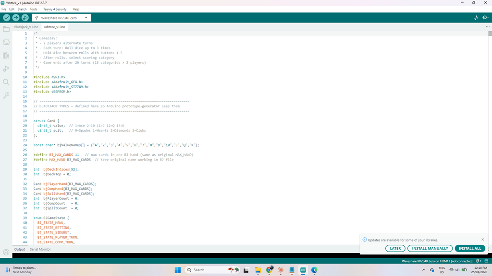

# Yahtzee - Raspberry Pi Handheld Game

Source: https://www.instructables.com/Yahtzee-Raspberry-Pi-Handheld-Game/

---

## Introduction

## Supplies

As usual, I've created a parts list which can be found in my GitHub page and in the PDF file attached to this step. The PDF includes links and images of each of the parts which will make it easy to order the correct ones for this build.The parts list attached doesn't included the PCB or front panel. You'll need to jump to the next step which goes through how to get yours printed.Parts List.pdfDownload

## Step 1: About the AI

How the Yahtzee AI WorksWhen I first went on the journey to add a player 1 vs the computer, I didn't think it would take me down such a deep rabbit hole. The game of Yahtzee is a game of subtle nuances that revealed themselves to me when I tried (and still trying) to make an AI 'God Mode'. I wanted an unbeatable opponent, someone that always knows the right rolls and holds and could use probability, strategy and learned weights to never lose. The below is an outline of where I am currently.In a NutshellThe AI holds dice based on what it's closest to completing, always thinking about whether the potential reward is worth the risk of rerolling. It respects special categories like Yahtzee and Large Straight enough to keep chasing them even late in a roll. It gets smarter the more you play against it, gradually learning what tends to win and adjusting its priorities accordingly. And at higher difficulties, it's simply more willing to gamble on a better outcome rather than accepting a safe but mediocre score.The Big PictureThe AI isn't just picking randomly or following a simple checklist. It's constantly asking itself two questions on every turn: "Which dice should I keep?" and "Is what I have now worth stopping for, or should I roll again?" Everything it does flows from trying to answer those two questions as smartly as possible.How It Decides Which Dice to HoldThink of the AI like a card player who's always looking at their hand and asking "what am I closest to completing?" It looks at the dice and runs through a mental checklist, roughly in this order:First, is the game almost over? If there are only 2 or 3 scoring boxes left to fill, it stops being flexible and commits completely to whatever it still needs — chasing a Yahtzee, holding a straight sequence, or locking in pairs for a Full House. No second-guessing at that point. Crucially, it uses the actual remaining categories to decide what to hold — it won't hold two different numbers if neither of the remaining categories can use them.Second, are we close to the upper section bonus? The +35 bonus for scoring 63+ points in the top half of the scorecard is huge. If the AI is getting close, it'll often prioritize holding dice that help fill those upper boxes (Ones through Sixes), even if it means passing on something flashy.Third, what's the best hand it's sitting on? It looks at whether it has four-of-a-kind, three-of-a-kind, a pair, or a run of consecutive numbers, and figures out which of those is worth developing. Importantly — it doesn't just hold the "most dice." It asks which hand is actually worth the most if completed. Four 1s sounds like a lot to hold, but if the Ones box is already filled and Yahtzee is still available, it'll go for Yahtzee instead.One key rule it follows hard: Pairs beat nothing, but a straight run beats a pair. If you have something like 2-3-4-5 showing, the AI will completely ignore any pair in those dice and hold the run, because straights are worth a flat 30 or 40 points — more predictable and often more valuable than trying to build three-of-a-kind from a low pair.Probability Tables and Expected ValueRather than using gut feel, the AI uses hardcoded probability tables to calculate the exact odds of completing any hand from its current dice. These are precomputed two-dimensional tables:Of-a-Kind table: probability of hitting 2-, 3-, 4-, or 5-of-a-kind when rerolling a specific number of dice (e.g. holding 3-of-a-kind and rerolling 2 dice has roughly a 7.4% chance of hitting 5-of-a-kind in one roll).Large Straight table: probability of completing a Large Straight based on how many values are still missing and how many rolls remain.Small Straight table: same for Small Straight.For each possible way to hold the dice, the AI computes an Expected Value (EV) — the average score it can realistically expect if it plays that way. It then picks whichever hold pattern produces the highest EV, adjusted by the learned weights described below. This EV approach is the core engine; everything else (special cases, endgame logic, opponent model) either feeds into it or overrides it when warranted.Locked Decisions: When EV Doesn't ApplySome situations are so mathematically clear that the AI locks the decision before any EV comparison or opponent-model adjustment is allowed to interfere:4-of-a-kind with Yahtzee open: always reroll the 5th die — the chance of completing a Yahtzee is too valuable to ignore.3-of-a-kind with Yahtzee open (or high value): always hold the triple and chase the 4th (and potentially 5th) match.Yahtzee or Large Straight already in hand: always stop.Small Straight in hand with Large Straight already used: always stop and bank the guaranteed 30 points.These decisions set a 'decision made' flag that prevents any downstream logic — conservative opponent overrides, endgame risk adjustments, trailing/leading adjustments — from cancelling them.How It Decides Whether to Roll AgainOn each roll, the AI looks at what it currently has and compares it to what it could get with another roll. A few rules of thumb guide it:After the first roll, it almost always rerolls. One roll with a random set of dice rarely gives you the best possible outcome, so unless it rolled a Yahtzee or Large Straight right out of the gate, it's rolling again. There's also a minimum score floor: on the first roll, the AI won't stop unless it has 35+ points in hand (40+ on God Mode) — no matter what the EV says.After the second roll, it gets more selective. If what it has now is good enough — say, a confirmed Full House or a solid score in an upper box — it'll stop. But if it has four-of-a-kind with Yahtzee still available, or four numbers in a row with Large Straight still available, it'll always take that third roll. Those are too valuable to give up.It also reads the score. If the AI is losing by a decent amount, it plays more aggressively — willing to risk a worse outcome for a shot at something big. If it's comfortably ahead, it plays it safe and locks in reliable points.Difficulty MarginsDifficulty directly affects how much better the EV of rerolling needs to be before the AI commits to it:Normal: EV of rerolling must exceed current score by at least 3 points before it takes the risk.Hard: EV must match or exceed current score (break-even is enough to reroll).God Mode: Will reroll even if EV is slightly lower than the current score — always chasing the maximum.The Three Difficulty LevelsNormal — Plays a solid but forgiving game. Stops rolling if it has a decent score, won't chase long shots. Good for casual play.Hard — More aggressive. Willing to reroll a decent hand in search of something better. Understands when high-value setups like four-of-a-kind are worth gambling on. Also uses learned data to slightly adjust its aggressiveness — if aggressive play has been winning more often than conservative play, it leans harder into it.God Mode — Almost never stops after just one roll. It squeezes every last roll out of every turn, always chasing the maximum possible outcome. Very tough to beat consistently.Each difficulty also has its own base aggressiveness setting (0.35 for Normal, 0.65 for Hard, 0.95 for God Mode) which is used to scale certain risk-taking decisions beyond just the roll-again margin.Exploration vs ExploitationAbout 10% of games, the AI deliberately plays differently from its learned "best" strategy. This is called an exploration game — it picks a random strategy (conservative or aggressive) with a randomized aggressiveness weight somewhere between 0.3 and 0.9. The other 90% of games it sticks to what's been working best — this is exploitation. This balance ensures the AI doesn't get permanently stuck doing the same thing if something slightly different would actually work better.How It Learns Over TimeThis is where it gets interesting — the AI actually remembers how past games went and slowly adjusts its behavior. All learning data is saved to the device's EEPROM (non-volatile flash memory), so it persists even after you turn it off. A checksum is stored alongside the data so the device can detect and recover from any corruption.Here's what it tracks and learns from:What scores tend to lead to wins. If the AI notices that games where it scores a Large Straight tend to go well for it, it'll start prioritizing Large Straights a little more. If Full Houses don't seem to help much, it pulls back on chasing them. These preferences are stored as weight values for each category type.How confident it is in each weight. The AI doesn't treat all its data equally. Each weight adjustment is scaled by how many data points back it up — a weight based on 50 games carries four times more authority than one based on only 5 games. Early in its learning life the AI makes small cautious adjustments; as data builds it makes larger, more decisive ones.Whether rerolling was actually worth it — by score bracket. Every time the AI rerolls, it records what score it had available before rolling and whether the result was better or worse. It tracks this in four separate buckets based on starting score (0–9, 10–19, 20–29, 30+). Over time it builds a detailed picture — "when I had 20–29 points and rerolled, did it usually pay off?" — and adjusts its reroll threshold accordingly for each bracket.How each specific hold pattern performs. For every combination of dice value and count held (e.g. "held two 5s", "held three 6s"), it records how often that pattern led to a score of 20 or more. This is tracked in a 6×6 grid (values 1–6 × counts 1–5). These per-pattern quality scores feed back into hold decisions.When chasing Yahtzee or straights historically pays off. Separate success rate counters track every time the AI pursued a Yahtzee, Large Straight, Small Straight, Full House, 3-of-a-Kind, or 4-of-a-Kind, and how often it actually completed it. If the Yahtzee success rate falls below 12%, it tightens the entry threshold (only chases with 3+ matching dice). If the rate climbs above 28%, it gets more aggressive (will chase from just a pair with 2 rolls left).Which hold pattern count works best (0–5 dice held). The AI tracks how often it held 0, 1, 2, 3, 4, or 5 dice and which hold counts were most associated with wins. This isn't used to override decisions directly, but is displayed in the stats screen and informs the big picture of how the AI is playing.Endgame close-game outcomes. From turn 11 onwards, if the game is within 20 points, the AI records whether it won or lost. If it's historically been struggling to close out tight games (win rate below 45%), it becomes more aggressive in the final turns — more willing to take a risky roll rather than banking a mediocre score.The Chance category timing. Chance (score any total) is most valuable early in the game when all other slots are still open and future scores are unpredictable. The AI tracks when it scores Chance (turns 1–3, 4–6, 7–9, or 10–13) and how often each timing leads to a win. It also tracks head-to-head outcomes of "took Chance vs took a weak upper slot" so it can make a better decision in that recurring dilemma.Score position at turn 10. This is tracked as a running average of (AI score minus human score) at the exact halfway point of every game. If the AI is consistently 20+ points behind at turn 10, it's a signal that it's being too conservative in the first half — so it raises the aggression on early rerolls.Category timing. For each of the 13 scoring categories, the AI tracks the average turn it tends to score that category. This historical timing data is stored and helps inform category priority in future games.What you tend to do. The AI quietly tracks your playing style — how often you hit the upper bonus, how many Yahtzee's you roll, how aggressive you are (measured by reroll rate and chase attempts), and your average score. It uses this to calibrate its own play:Against a strong player (average score over ~250 per category) it plays harder, rerolling on scores it might otherwise accept.Against a conservative player it locks in moderate scores more readily, since you're unlikely to punish it with a spectacular turn.If you frequently score Yahtzee's, the AI prioritizes chasing its own Yahtzee more urgently.The Four Strategies It Tests Against ItselfWhen you use the Train AI option in the Tools menu, the AI plays against itself to practice. It runs four different versions of itself with slightly different personalities:Aggressive — Goes hard for Yahtzee's and big straights, willing to sacrifice safe pointsBalanced — Uses whatever it's currently learned as its best approachConservative — Prioritizes guaranteed points and the upper bonus over risky special handsExperimental — A slightly randomized version, trying things a bit differently each timeAfter each batch of self-play games, it looks at which personality won the most and nudges its main strategy a little in that direction. It's a slow process — you won't see it transform overnight — but over dozens of games it genuinely does shift toward what's been working.Each strategy variant stores its own set of 8 weight values alongside its performance record (wins, games played, total score). The system uses exploration vs exploitation here too — it mostly picks the variant with the best recent win rate, but occasionally gives the others a shot so they can keep accumulating data.Category SelectionOnce the AI has decided to stop rolling, it chooses which scoring category to use. This is more nuanced than it might appear:It calculates an expected value for every open category given the current dice.Upper section categories are weighted by a bonus feasibility score — if the 35-point bonus is still realistically achievable, upper section slots get a boost proportional to how much they contribute toward hitting 63.It also considers opportunity cost — using a high-value slot (like Sixes) for a weak result is penalized more than using a low-value slot (like Ones) for the same score.In the final 1–2 turns, category selection becomes critical and the AI commits fully to what it needs: it won't squander a Yahtzee chase on a 3-of-a-kind slot, and it won't take Chance if a more targeted category is still reachable.What Gets Displayed in the Stats ScreensThe AI Statistics screen (accessible from the Tools menu) shows six pages of data including: overall win rate and score history, reroll improvement rates per score bracket, hold pattern frequency, endgame win rates in close games and blowouts, the four strategy variant performances, Chance category timing, turn-10 score position history, and the current live values of all 8 learned weights. The graphs also track early-game vs recent-game average score so you can see whether the AI is improving over time.Timeout ProtectionIf the AI ever gets into an unexpected state and takes more than 30 seconds to make a decision on any turn, a watchdog timer forces it to pick the best available category immediately and resets its state. This prevents the game from ever hanging.A note on 'God Mode'God Mode is the closest the AI gets to theoretically optimal Yahtzee play. It uses maximum aggression, the full probability tables, all learned weights, and never applies conservative overrides. It is beatable — Yahtzee has a meaningful luck component — but it will consistently make the highest expected value decision available to it on every single roll.

## Step 2: Getting the PCB & Front & Back Panel Printed

We all have different levels of knowledge, so when it comes to a build like this I want to make sure that I'm providing enough information so anyone with some basic soldering skills can make it. That includes ensuring there are instructions on how to get your own PCB's printed (which is super easy!)So with that said, the first thing you will need to do is to get the front panel and PCB printed. I use JLCPCB (not affiliated) to get this done. The front panel is actually just a PCB without any components included! The front panel design is done in a program called Inkscape (available free) and the panel including the drilled holes is done in Fusion 360 (also free!)The files that you need to build the Yahzee game can be found in my GitHub page. This also includes the parts list, Gerber files for the PCB & front panel, schematic, Code. Download the files to your computerSTEPS:Send the Gerber files (zipped) to a PCB manufacturer like JLCPCB who will print the PCB and front panel for you. Download all of the files from my GitHub page to your computer and send the zipped Gerber files off to the PCB manufacturer of choice.If you have no idea what any of the above means , then check out the Instructable I made on how to get your broads printed which can be found here.JLCPCB used to print an order number onto the PCB which was super annoying, especially if you didn't specify where to add it. Now you don't have to worry about it as they no longer do itwhen choosing the surface finish pick Lead Free HASL as this will ensure that there is no lead in the panel or PCB.You can pick whatever colour you want to choose for your front panel and PCB. I used black.

## Step 3: Adding the Screen

NOTE - you might notice some changes in the design of the panels and PCB.  That's because I took images for this Instructable of the first version.  I'm now on the improved 2nd version which is slightly different in design.The following step ensures that you can remove the front panel easily and without having to de-solder anything. This is important, especially for maintenance, battery changes, troubleshooting etc. STEPS:First, trim the tops of the header pins where they are soldered. You just want to remove a small bit of the top of the header pin so they won’t interfere with the front panel.In the front panel, there are 4 holes where the TFT screen will be attached. Add a 20mm M2 screw (I like to use hex socket head screws) to each and then add a M2 nut to secure the screws into placeNow, place the screen on top of the screws and align it to the front panel. The screen should sit flat to the front panel as the nuts you added earlier act like spacers.Now - you need to add a small M2 spacer (5mm) to each of the screws. Use the smallest one in the assorted pack that I have recommended to get in the parts listRemove the plastic section off the male header pin. This will ensure that they fir right in the female header pinYou can now add the low profile female header pins to the male ones on the TFT screen and do a test fit. You will need to trim the male header pins a little in order for them to sit right in the female header. What I usually do here is, lay a female header pins on top of the male ones and mark out how much to cut of the male header pins. It probably about 3mm that you need to remove.Don’t solder the female header pins yet to the PCB, we’ll do that near the end

## Step 4: Solder the Pins on the 7 Seg Display & Pi

This is a good time to get a couple of the other components ready to solder into placeSTEPS:Let’s start with the 7-segment display.  It’s important that you solder into place the male header pins first.  Also make sure that you have the PCB up the right way – not like me on the first crack at this!!Now you can add the 7 segment displays into place and also solder these.  Again, making sure that they are in the right way. (the decimal point on the bottom)Let’s move onto the Raspberry Pi.  Place each of the header pins into the holes on the Pi and just solder 1 leg of each of the 3 header pin sections.Ok - now move onto the next step

## Step 5: Adding the Pi & Charging Module to the PCB

STEPS:Place the Pi into the PCB and solder the rest of the legs to the solder points on the Pi.This ensures that the Pi fits perfectly into the PCB.  You can now solder the header pins to the PCB to secure the Pi into placeThe charging and voltage booster module is a great little board. It allows you to add say a 3.6V battery like a mobile one, and you can increase the output voltage via a small potentiometer located on the board.First, let’s set the output voltage to 5V from the Charging & voltage booster module. Connect the module up to a power source (this could be mobile phone battery, variable power source or whatever you have around, as long as it is lower than 5V’s)Now with a multimeter, check the voltage output. You need to try and get as close as possible to 5V’s so turn the potentiometer until you reach 5Vs.Now you can add the module to the PCB. I added a little superglue to the bottom of the board to ensure it was secured into placeAdd some solder to each of the solder points on the module and then add some wire from a resistor leg to each solder point.Bend the wire down so it is touching the solder pad on the PCB and trim.Add solder to the solder pad on the PCB and connect the wire to each. This will give you a good strong connection.

## Step 6: Adding the Buttons and Switches

I’ve used a red and black momentary buttons to help differentiate the button controls.  It isn’t necessary but I think it helps identify the right buttons to use.STEPS:This is pretty straight forward, you are just soldering the button switches into place.  However, it is important to make sure that they are straight on the PCB or the front panel won’t fit correctly so here’s what you do to ensure that they are all align correctly.Place the front panel onto the PCB.  This will act as a template in order to ensure that the button switch is aligned correctlyPlace the button switch into place and solder the legs to the PCB.  Press down on top of the button and use the soldering iron to remelt each of the solder points for the switch.  This will correctly seat the switch if it isn’t already.Do the same for the rest of the button switches,Now you can solder into place the 2 slide switches.  One is for on/off and the other is used when charging the battery.  I had to add one for the battery charging because if you don’t have it there, you need to have the game on whist charging.  The other option would have been to add the main switch after the battery charging module.  However, these little modules can draw a very slight charge which will flatten the battery over time.Note that I used a push button on/off switch in my prototype.  I didn’t like it so I moved it to the slide switch!You can now remove the front panel

## Step 7: Adding the Battery

I have used a phone battery as the power source.  These work great and even an old second-hand one will do the job just fine.  You can also buy new ones still at a good price.STEPS:First, add some solder to the positive and negative solder points on the battery. Make sure your soldering iron is hot when doing this and try and do it as quickly as possible. Now add a resistor leg to each solder point and bend so they are lying flat with the battery.Add a little superglue to the battery and glue into place.Trim the wire if necessary and then solder onto the solder points on the PCB

## Step 8: Uploading the Code

So - I have provided an exact, step by step guide on how to Upload the code to your Raspberry Pi. If you follow the below, you won't have any issues with uploadeding the sketch.Step 1 — Install the Arduino IDEGo to https://www.arduino.cc/en/softwareDownload Arduino IDE 2.x for your operating systemRun the installer and follow the promptsOpen the Arduino IDE once installedStep 2 — Add the RP2040 Board PackageThe Arduino IDE does not support the RP2040 out of the box. You need to add it via a custom board URL.Open Arduino IDEGo to File → Preferences (macOS: Arduino IDE → Settings)Find the "Additional boards manager URLs" fieldPaste this URL:https://github.com/earlephilhower/arduino-pico/releases/download/global/package_rp2040_index.jsonClick OKGo to Tools → Board → Boards ManagerSearch for rp2040Find "Raspberry Pi Pico/RP2040 by Earle F. Philhower, III"Click Install — this downloads around 500MB and may take a few minutesClose the Boards Manager when doneStep 3 — Install the Required LibrariesGo to Tools → Manage Libraries and search for and install each of the following:Adafruit GFX LibraryAdafruit ST7735 and ST7789 LibraryWhen installing the ST7789 library, a popup will ask "Install all dependencies?" — click "Install All". This also installs the required Adafruit BusIO library automatically.SPI and EEPROM are both built into the RP2040 board package and do not need separate installation.Step 4 — Set Up the Sketch FolderThe code is split across two .ino files. Arduino requires all files in a sketch to be in the same folder, and that folder name must exactly match the main .ino filename.Create a folder named exactly:Yahtzee_v1Place both files inside it:Yahtzee_v1_fixed.inoBlackjack_V1.inoIn Arduino IDE go to File → OpenNavigate into the Yahtzee_v1_fixed folder and open Yahtzee_v1_fixed.inoBoth files should appear as two tabs at the top of the IDE. If you only see one tab, the folder name or file placement is wrong — fix that before continuing.Step 5 — Select the Waveshare RP2040 Zero BoardGo to Tools → Board → Raspberry Pi RP2040 BoardsSelect "Waveshare RP2040 Zero"If you don't see "Waveshare RP2040 Zero" listed, select "Raspberry Pi Pico" instead — the RP2040 Zero is pincompatible and this will work correctly.Set the following options under the Tools menu:Setting Value:Flash Size - 2MB (no FS)CPU Speed - 133 MHzOptimize - Optimize Even More (-O3)USB Stack - Pico SDKDebug Level - NoneStep 6 — Put the Board Into Upload Mode (BOOTSEL)The RP2040 Zero needs to be in bootloader mode before it will accept an upload.Unplug the board from USB if currently connectedHold down the BOOT button on the RP2040 Zero — this is the small button labelled BOOT on the boardWhile holding BOOT, plug the USB-C cable into the board and into your computerRelease the BOOT button after plugging inYour computer will now recognise the board as a USB storage drive called RPI-RP2. You do not need to do anything with this drive — the Arduino IDE handles everything automatically from here.Tip: If your computer doesn't show the RPI-RP2 drive, your USB cable is likely charge-only. Try a different cable.Step 7 — Select the COM PortGo to Tools → PortSelect the port for the RP2040 Zero:Windows: will appear as COM3, COM4, or similarmacOS: will appear as /dev/cu.usbmodem...Linux: will appear as /dev/ttyACM0If no port appears, unplug and replug the cable and try again. Make sure you completed Step 6 (BOOTSEL mode) correctly.Step 8 — Compile and UploadClick the Upload button (the → arrow in the top-left toolbar), or go to Sketch → UploadThe IDE will compile the code first — expect 30–90 seconds on the first compileIt will then automatically flash the binary to the boardWatch the bottom console for progress — a successful upload ends with something like:Wrote XXXXX bytes to flashThe board will automatically reboot and start running the game immediatelyIf compilation fails, the most common causes are:A library is missing — re-check Step 3Wrong board selected — re-check Step 5Both .ino files are not in the same correctly-named folder — re-check Step 4Step 9 — Verify It's WorkingThe board reboots automatically after upload. Within one or two seconds you should see the intro animation on the ST7789 TFT display.If the screen stays blank:Check all wiring against the pin table belowConfirm your TFT uses the ST7789 driver chip (not ST7735 — different driver)The code uses SPI1 (the secondary SPI bus) — make sure you are wired to GP10/GP11, not GP18/GP19 which are the default SPI0 pinsStep 10 — Future Uploads (No BOOTSEL Needed)After the first successful upload, all subsequent uploads do not require holding the BOOT button. The Arduino IDE can reset the board into bootloader mode automatically over USB.Just make your changes and click Upload — it will handle the reset for you. If the automatic reset ever fails and the IDE reports it can't find the port, manually enter BOOTSEL mode again using the Step 6 method.

## Step 9: How to Play

The goal of Yahtzee is to roll 5 dice in 13 rounds and try and get a higher score than your opponent. Sounds pretty simple and a game based on luck right! Well, just like any good game, there is some luck involved but also a good chunk of skill and a little bit of je ne sais quoi!You can find the rules in the actual game itself under tools. Also check out the official rules here.Hardware OverviewThe console has 10 buttons and two displays:ButtonLabel / PositionPrimary Function5 × Hold buttons - Hold dice 1–5 during a turnROLL - Roll dice / confirm in menusNavigation button - Scroll menus up & down / view upper/lower scorecardENTER - Confirm button & Select menu item / confirm categoryThe TFT screen shows menus, dice, the scorecard, and all AI information. The 5-digit 7-segment display shows the current dice values, with a decimal point lit on any die that is held.Turning On / Start ScreenPower on and the console plays an animated intro — five dice tumble onto the screen and the YAHTZEE title assembles itself. After the animation settles you are taken to the main menu automatically.Main MenuThree options, navigated with UP / DOWN, selected with ENTER:2 Player Game — Two humans take turns on the same console.  13 turns each (26 total turns).1 vs Computer — Play against the AI. Selecting this opens the difficulty menu before starting.Tools — Settings, statistics, AI training, and bonus games.Choosing AI Difficulty (1 vs Computer)After selecting 1 vs Computer, choose one of three difficulty levels with UP / DOWN, then press ENTER to start. Press ROLL to cancel and go back.DifficultyDescriptionNormal - Conservative, forgiving play. Targets ~50–60% win rate. Learns within a moderate aggression band.Hard - Balanced aggressive strategy. Targets ~60–70% win rate. This is the default.God Mode - Maximum aggression, fixed strategy. Targets ~85–95% win rate. Does not adapt — it is always at full aggression.Each difficulty stores its learned behaviour independently, so playing Normal does not affect the Hard AI's memory or strategy.Playing a Turn1. Roll — Press ROLL to throw all five dice. The 7-segment display flashes during the animation, then shows the result with decimal points on any held dice.2. Hold dice — Press Hold 1–5 to hold or un-hold individual dice. Held dice are skipped on the next roll and shown with a decimal point on the 7-segment.3. Roll again — Press ROLL up to two more times (three rolls total per turn). You can stop early at any point.4. View your scorecard — During rolling, press UP to see the upper section (Ones–Sixes) or DOWN to see the lower section (3-of-a-kind through Chance). The scorecard highlights which categories are still available and shows what each would score with your current dice.5. Select a category — After your final roll (or when you choose to stop), the game enters category selection. Navigate with UP / DOWN — used categories are automatically skipped. Press ENTER to confirm.Every turn you must score somewhere. If nothing fits, pick a category to sacrifice and score zero.Auto-Advance ModeWhen enabled (set in Tools), the human player's first roll is thrown automatically at the start of each turn. Useful for keeping the game moving. Toggle it on/off in Tools → Auto-Advance.Game EndAfter all 13 categories are filled for both players (26 turns total), the game calculates final scores including the upper section bonus (+35 if you scored 63+ in Ones–Sixes) and any Yahtzee bonuses (+100 each for additional Yahtzees after the first). The winner is announced with a celebration animation. Press ROLL to return to the main menu.Tools MenuFrom the main menu, select Tools with ENTER. Navigate with UP / DOWN, select with ENTER.ItemWhat it does7-Seg Bright - Adjust the brightness of the 7-segment dice display. Press ENTER to enter adjustment mode, then UP/DOWN to change level, ENTER to confirm.Sound - Toggle sound on/off and set volume (1–3).Auto-Advance - Toggle automatic first-roll at turn start.Statistics - View overall game stats: high score, win/loss record, most Yahtzees in a game. Hold ROLL for 3 seconds to reset these stats.AI Stats - Six pages of detailed AI learning data (see below).AI Speed - Set how fast the AI takes its turn: Slow (5s) → Medium (3.5s) → Fast (2.5s) → Instant (0.5s). Press ENTER to cycle.Train AI - Run AI self-play training games (see below).Export Stats - Dumps all AI learning data to the Serial Monitor at 115200 baud as a CSV. Useful for analysis in Excel or Google Sheets.AI Graphs - Six live performance graphs (see below).Game Rules - On-screen Yahtzee rules reference, 4 pages.Blackjack - Launches the built-in Blackjack game. Hold ROLL for 3 seconds from the Blackjack menu to return to Yahtzee.Back - Return to the main menu.AI Training (Self-Play)Select Tools → Train AI. Use UP / DOWN to choose how many games to run (10–500, default 50). The display estimates how long it will take (~5 games per second). Press ENTER to start or ROLL to cancel.During training, four strategy variants compete against each other. Each variant has different weightings for Yahtzee, straights, Full House, 3-of-a-kind, and upper bonus pursuit. After training, the best-performing variant's weights are blended into the main AI and saved to memory.When to train: Run training when you first build the console to give the AI a baseline, then again after 20–30 games against it to let it refine based on what it has learned from playing you. You do not need to retrain regularly — the AI also learns continuously from every real game.Reset AI learning: From Tools → AI Stats, hold ENTER for 3 seconds. This wipes all learned weights and statistics and resets the AI to its factory defaults.AI Stats (6 Pages)Navigate pages with UP / DOWN, press ENTER to go back.PageShows Learned Weights - Current strategy weights the AI has converged on: how much it prioritises Yahtzee, straights, Full House, 3-of-a-kind, and the upper bonus. Win rate vs human, games played, self-play training games.Opponent Model - What the AI has learned about your play style: your average score, how often you achieve the upper bonus, your risk level (based on how often you go for Yahtzees and straights), and your total Yahtzees scored.Strategy Variants - Win rates and average scores for the four competing strategy variants (Aggressive, Balanced, Conservative, Experimental). Shows which variant is currently winning and how many games each has played.Category Usage - Win rate when the AI scores each of the 13 categories, plus turn-phase performance (how often it wins when leading vs trailing at turn 10).Decision Quality - Reroll quality stats — how often rerolling improved the score, broken down by score bracket. Shows Chance timing win rates by game phase and weight health indicators (flags any weights stuck at their min/max limits).Bonus Analytics - Upper bonus pursuit stats: near-misses, overkills, win rate when bonus is abandoned, and average score differential at turn 10.AI Performance Graphs (6 Pages)Navigate with UP / DOWN, back with ENTER.Learning progress — early vs recent win rate trendStrategy variant comparison — bar chart of win ratesDecision quality over timeScore distribution histogramCategory efficiency — how well each category is being usedWin rate trends

---
*51 images archived*
